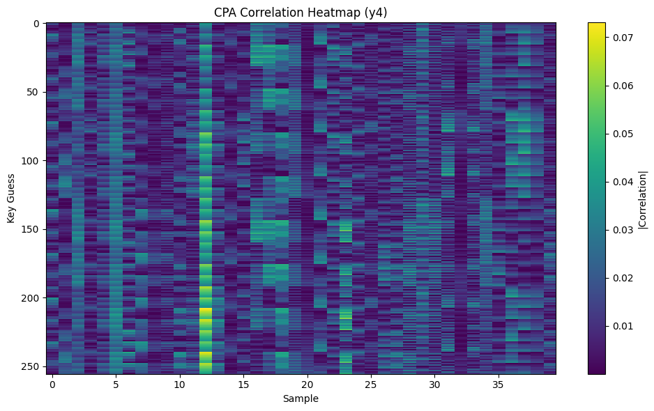
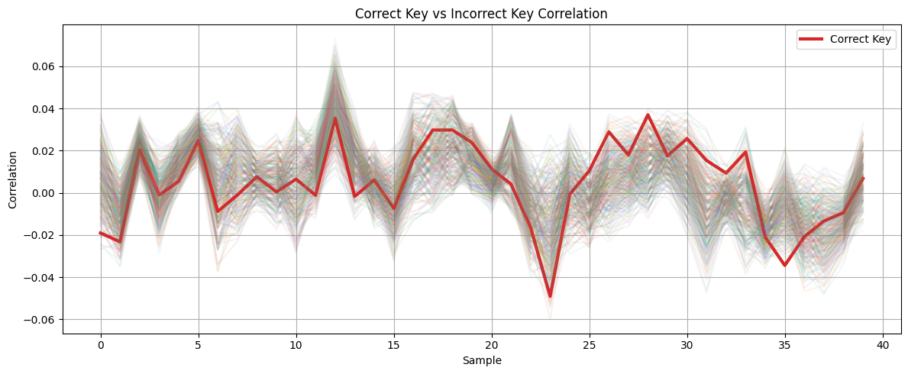
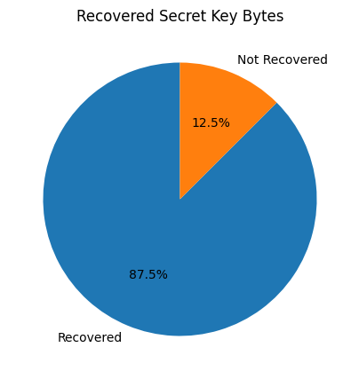
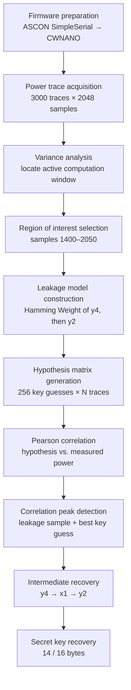

<div align="center">

# Correlation Power Analysis of ASCON-128 on the ChipWhisperer Nano

**Recovering a NIST-standardized lightweight cipher's secret key from nothing but its power consumption.**

      

[Overview](#overview) • [Why This Matters](#why-this-matters) • [Results](#results-at-a-glance) • [Repository Layout](#repository-layout) • [Reproducing the Attack](#reproducing-the-attack) • [Documentation](#full-documentation) • [Roadmap](#roadmap)

</div>

---

## Overview

ASCON is the algorithm NIST selected in 2023 to become the U.S. standard for **Lightweight Cryptography** — the family of ciphers meant to secure the billions of constrained devices (sensors, RFID tags, implants, industrial controllers) that can't afford the silicon or power budget of AES. Its selection came after years of public cryptanalysis confirming that, mathematically, ASCON is sound.

This repository asks a different question: **does a straightforward, unprotected software implementation of ASCON leak its key simply by consuming power?**

The answer, demonstrated end-to-end in this project, is yes. Using a **ChipWhisperer Nano** — the cheapest commercially available side-channel toolkit — and **3,000 power traces** captured from an **STM32F0** running the unmodified ASCON-128 reference implementation, a first-order **Correlation Power Analysis (CPA)** attack recovers **14 of the 16 secret key bytes** without ever touching the plaintext, ciphertext, or any mathematical weakness in the cipher itself.

Where most public CPA write-ups attack the AES S-box — a convenient 8-bit lookup table — ASCON has no such table. It is a **bit-sliced, Boolean-only permutation**. Every leakage model used here had to be hand-derived from ASCON's internal equations rather than borrowed from an existing tutorial. That derivation, and everything that follows from it, is documented chapter by chapter in [`docs/`](docs/).

> **Scope note:** this project targets an implementation, not the algorithm. Nothing here constitutes a break of ASCON's cryptographic design. See [Disclaimer](#disclaimer-and-scope).

---

## Why This Matters

A cipher's mathematical security and its implementation's physical security are two separate properties, and a system is only as strong as the weaker one:

| Property                    | Question it answers                                                        | Where ASCON stands                                                                             |
| --------------------------- | -------------------------------------------------------------------------- | ---------------------------------------------------------------------------------------------- |
| **Algorithmic security**    | Can an attacker break the cipher given only inputs/outputs?                | Extensively analyzed, standardized by NIST — considered strong                                 |
| **Implementation security** | Can an attacker learn the key by *observing the device* while it computes? | **This is what this repository tests** — and the unprotected reference implementation fails it |

This gap is exactly why side-channel resistant implementations (masked, shuffled, hidden) exist for every deployed cipher, ASCON included. Demonstrating the gap concretely — with real hardware, real traces, and a real recovered key — is the purpose of this project.

---

## Results at a Glance

| Parameter               |                                       Value |
| ----------------------- | ------------------------------------------: |
| Target cipher           |               ASCON-128 (NIST LWC standard) |
| Target implementation   | Unprotected C reference (`ascon128v12/ref`) |
| Target MCU              | STM32F0 (ChipWhisperer Nano onboard target) |
| Acquisition platform    |                          ChipWhisperer Nano |
| Traces captured         |                                   **3,000** |
| Samples per trace       |                                   **2,048** |
| Region of interest      |         Samples 1,400 – 2,050 (650 samples) |
| Final attack window     |          Samples 1,730 – 1,770 (40 samples) |
| Leakage model           |                              Hamming Weight |
| Distinguisher           |             Pearson correlation coefficient |
| Attacked round          |                     Initialization, Round 1 |
| Intermediate targets    |                          `y4` → `x1` → `y2` |
| **Key bytes recovered** |                                 **14 / 16** |

<p align="center">
  
  
</p>
<p align="center"><em>Left: mean of 3,000 acquired power traces. Right: correlation heatmap (key guess × sample) for the y4 leakage model — the horizontal band marks the correct key hypothesis.</em></p>

<p align="center">
  
  
</p>
<p align="center"><em>Left: the correct key hypothesis (bold) separates cleanly from all 255 incorrect guesses at the leakage sample. Right: final key-byte recovery outcome across the full 16-byte key.</em></p>

*(Rendered figures live in [`figures/`](figures/) and are generated directly from [`jupyter/ascon_cpa.ipynb`](jupyter/ascon_cpa.ipynb) — see [Reproducing the Attack](#reproducing-the-attack) below to regenerate them from your own captures.)*

---

## Repository Layout

```text
ascon-cpa-cwnano/
│
├── README.md                        ← you are here
│
├── docs/                             13-chapter research writeup
│   ├── 01_Abstract.md
│   ├── 02_Background.md
│   ├── 03_ASCON_Architecture.md
│   ├── 04_CPA_Theory.md
│   ├── 05_Experimental_Setup.md
│   ├── 06_Firmware_Modifications.md
│   ├── 07_Trace_Capture.md
│   ├── 08_Leakage_Model.md
│   ├── 09_CPA_Attack.md
│   ├── 10_Results.md
│   ├── 11_Limitations.md
│   ├── 12_Development_Journey.md
│   └── References.md
│
├── figures/                          Generated plots referenced by docs/README (PNG/SVG)
│   ├── fig01_average_power_trace.png
│   ├── fig02_variance_plot.png
│   ├── fig03_random_traces.png
│   ├── fig04_region_of_interest.png
│   ├── fig05_attack_window.png
│   ├── fig06_correlation_heatmap_y4.png
│   ├── fig07_correlation_heatmap_y2.png
│   ├── fig08_correct_vs_wrong_keys.png
│   ├── fig09_max_correlation_per_key_guess.png
│   ├── fig10_top20_key_guesses.png
│   ├── fig11_correlation_peak_location.png
│   ├── fig12_key_recovery_summary.png
│   └── fig13_traces_vs_recovery_rate.png
│
├── firmware/
│   └── simpleserial-ascon/          Modified ASCON SimpleSerial firmware (CWNANO target)
│
├── jupyter/
│   └── ascon_cpa.ipynb              Full acquisition + CPA pipeline, produces all figures above
│
└── results/                          Numerical outputs of the attack (correlation tables, recovered bytes)
    └── recovered_key.md
```

> Figures are intentionally versioned as static images rather than only living inside the notebook, so they render directly on GitHub without anyone needing to open Jupyter.

---

## Attack Pipeline



Each stage above corresponds to one or more chapters in [`docs/`](docs/); see the [Documentation](#full-documentation) table for the mapping.

---

## Reproducing the Attack

1. **Hardware.** A ChipWhisperer Nano (with its onboard STM32F0 target) and a host machine with the ChipWhisperer Python API installed.
2. **Firmware.** Build and flash the modified firmware in [`firmware/simpleserial-ascon`](firmware/simpleserial-ascon) — configuration details and rationale are in [`docs/06_Firmware_Modifications.md`](docs/06_Firmware_Modifications.md).
3. **Acquisition.** Run the capture cells in [`jupyter/ascon_cpa.ipynb`](jupyter/ascon_cpa.ipynb) to collect your own traces (or substitute the provided dataset, if included under `results/`). This reproduces `docs/05` and `docs/07`.
4. **Attack.** Run the CPA cells to reproduce the variance analysis, leakage models, correlation matrices, and key recovery described in `docs/08` and `docs/09`. Each cell that produces a figure is annotated with the figure number it corresponds to in this README and in `docs/10_Results.md`.
5. **Compare.** Your recovered key, correlation magnitudes, and leakage sample indices will differ slightly from the ones reported here — they depend on your specific board, compiler version, and ambient noise. This is expected and discussed in [`docs/11_Limitations.md`](docs/11_Limitations.md).

---

## Full Documentation

This repository is intentionally documentation-heavy: every chapter explains not just **what** was done, but **why**, including the dead ends (masked firmware wouldn't build) and the mid-project corrections (variance peak ≠ correlation peak) that shaped the final methodology.

| #   | Chapter                                                     | What it covers                                                                      |
| --- | ----------------------------------------------------------- | ----------------------------------------------------------------------------------- |
| 01  | [Abstract](docs/01_Abstract.md)                             | One-page summary of the problem, method, and result                                 |
| 02  | [Background](docs/02_Background.md)                         | Side-channel analysis fundamentals; why power leaks at all                          |
| 03  | [ASCON Architecture](docs/03_ASCON_Architecture.md)         | Internal state, sponge construction, permutation, why Round 1 is the target         |
| 04  | [CPA Theory](docs/04_CPA_Theory.md)                         | SPA vs. DPA vs. CPA, Hamming Weight model, Pearson correlation, hypothesis matrices |
| 05  | [Experimental Setup](docs/05_Experimental_Setup.md)         | Hardware/software stack, acquisition parameters, dataset shape                      |
| 06  | [Firmware Modifications](docs/06_Firmware_Modifications.md) | Why the masked firmware failed to build and what replaced it                        |
| 07  | [Trace Capture](docs/07_Trace_Capture.md)                   | Acquisition methodology, variance-based region-of-interest selection                |
| 08  | [Leakage Model](docs/08_Leakage_Model.md)                   | Boolean derivation of `y4` and `y2`, the progressive recovery strategy              |
| 09  | [CPA Attack](docs/09_CPA_Attack.md)                         | Full attack implementation: hypothesis matrices → correlation → key recovery        |
| 10  | [Results](docs/10_Results.md)                               | Figures, recovered-key table, correlation rankings                                  |
| 11  | [Limitations](docs/11_Limitations.md)                       | Hardware, firmware, and statistical limitations; why 2 bytes weren't recovered      |
| 12  | [Conclusion & Future Work](docs/12_Development_Journey.md)  | Summary, lessons learned, roadmap for full key recovery                             |
| —   | [References](docs/References.md)                            | ASCON spec, NIST LWC materials, ChipWhisperer docs, CPA literature                  |

---

## Roadmap

- [ ] Recover the remaining 2 key bytes (likely needs more traces or a refined leakage window — see [`docs/11`](docs/11_Limitations.md))
- [ ] Re-run the trace-count sweep (500 → 3000) and publish the recovery-rate curve (Figure 13)
- [ ] Port the attack to a masked ASCON implementation once it builds cleanly for CWNANO
- [ ] Compare leakage behavior on STM32F3/F4 targets
- [ ] Explore Hamming Distance and bit-level leakage models as alternatives to Hamming Weight

---

## Key Contributions

- A complete, hand-derived first-order CPA attack against ASCON-128's Boolean permutation — no existing AES-style tutorial to copy from.
- Boolean leakage models for the intermediate variables `y4` and `y2`, enabling progressive (rather than brute-force) key recovery.
- A working ChipWhisperer Nano firmware port of the ASCON SimpleSerial target, including the engineering decisions needed to fit within its memory constraints.
- Empirical demonstration that variance-based region selection and correlation-based leakage localization identify *different* points in the trace — and why only the latter is safe to use for the actual attack window.
- 3,000-trace dataset and full analysis pipeline, reproducible end-to-end from firmware to recovered key.

---

## Acknowledgements

This work builds on:

- The [official ASCON reference implementation and specification](https://ascon.iaik.tugraz.at/)
- The [ASCON SimpleSerial firmware](https://github.com/ascon/simpleserial-ascon) for ChipWhisperer targets
- The [ChipWhisperer](https://github.com/newaetech/chipwhisperer) framework developed by NewAE Technology

All leakage models, firmware adaptations, acquisition workflow, attack implementation, and documentation in this repository were developed as part of this project.

## Disclaimer and Scope

This repository is for **educational and academic research** into implementation-level cryptographic security. It targets an unprotected reference implementation on hardware explicitly designed for side-channel education (ChipWhisperer Nano). It does not demonstrate, and should not be read as demonstrating, any weakness in the ASCON algorithm itself. The intent is to help students, researchers, and implementers understand *why* masked and hardened implementations of lightweight ciphers are necessary in practice.
