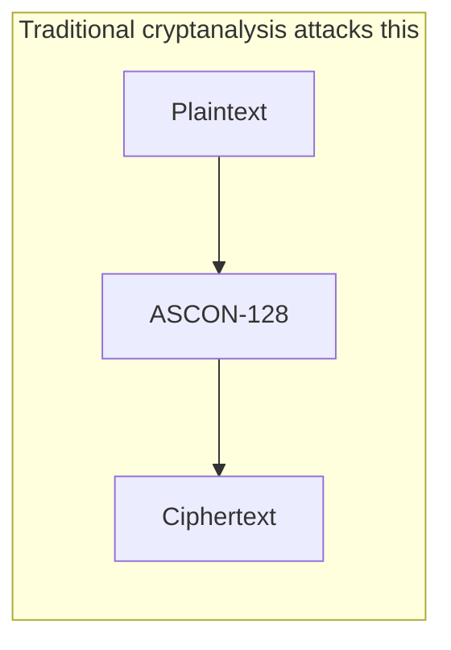
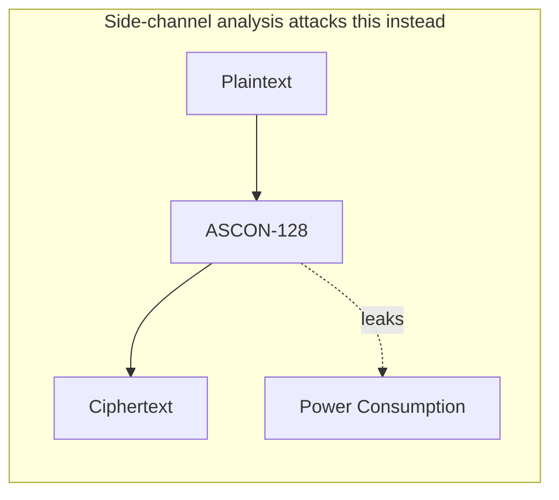

# Chapter 2 — Background

*[← 01 — Abstract](01_Abstract.md) · [README](../README.md) · Next: [03 — ASCON Architecture →](03_ASCON_Architecture.md)*

---

## 2.1 The Black-Box Assumption, and Why It Fails

Cryptographic algorithms are traditionally proven secure under a **black-box adversary model**: the attacker sees only the algorithm's mathematical inputs (plaintext, nonce, associated data) and outputs (ciphertext, tag), and the internal execution is assumed to be completely hidden. Under this model, breaking the cipher reduces to solving a hard mathematical problem — and for a well-designed algorithm like ASCON, that problem is believed to be computationally infeasible.

Real embedded devices do not honor this assumption. A microcontroller is not a mathematical abstraction; it is a physical object made of billions of transistors that must actually switch state to compute anything. Every one of those switching events:

- draws a measurable, time-varying amount of current from the power supply,
- radiates a small amount of electromagnetic energy,
- takes a data-dependent amount of time in some code paths,
- and, in extreme cases, produces measurable acoustic or optical emissions.

None of these physical effects were designed to carry information about the secret key. But because the switching activity of a CPU is directly driven by the *values* it's processing, and some of those values are derived from the key, the physical side effects end up statistically correlated with the key anyway. **Side-channel analysis** is the practice of exploiting that correlation instead of attacking the cipher's mathematics.

This is a crucial distinction: **an algorithm can be mathematically unbreakable while its implementation remains trivially vulnerable.** ASCON is a clean illustration of exactly this gap. It has survived years of public cryptanalysis and was selected by NIST specifically *because* of its strong security margins — yet, as this repository demonstrates, an unprotected software build of it running on an ordinary Cortex-M0 can leak most of its key through nothing more than its power-supply rail.

---

## 2.2 What Counts as a Side Channel?

A side channel is any unintended, measurable signal that correlates with internal computation. The most commonly exploited channels are:

| Channel | What it measures | Typical equipment |
|---|---|---|
| **Power consumption** | Instantaneous current drawn by the device | Shunt resistor + oscilloscope, or an integrated capture tool like ChipWhisperer |
| **Electromagnetic emission** | Radiated field from switching currents | Near-field EM probe + amplifier |
| **Timing** | Data-dependent execution time | High-resolution timer, no special hardware |
| **Cache behavior** | Data-dependent memory access patterns | Timing measurements on shared-cache systems |
| **Acoustic emission** | Audible/ultrasonic noise from components (e.g., capacitor whine) | Microphone |
| **Optical emission** | Photon emission from switching transistors | Specialized optical sensors (rare, lab-grade) |

This project uses **power consumption**, captured with a ChipWhisperer Nano, which places a shunt resistor in the target's power path and digitizes the resulting voltage drop with a synchronized ADC. The objective throughout is *not* to break ASCON's mathematics — it is to determine how faithfully the microcontroller's power rail reflects the secret data it is processing.

---

## 2.3 Why CMOS Circuits Leak: Static vs. Dynamic Power

Nearly every modern microcontroller is built from **CMOS** (Complementary Metal-Oxide-Semiconductor) logic, chosen specifically because it is extremely power-efficient — a CMOS gate draws almost no current while holding a static value. But "almost no current" is not "no current," and the small amount it does draw comes in two flavors:

**Static power** is consumed continuously, regardless of activity, from transistor leakage currents and bias currents. It contributes measurement noise but carries essentially no information about the data being processed.

**Dynamic power** is consumed *only* when a transistor changes state. Flipping a bit means charging or discharging the small parasitic capacitance at that gate's output, and that charge/discharge draws a short, sharp current pulse. Critically, the *number* of bits flipping in a given clock cycle roughly determines the *size* of that current pulse — which means:

> more bits switching → more current → higher instantaneous power → **power consumption is data-dependent**.

This data dependency is the entire premise of power analysis. It also motivates the specific leakage model used throughout this project ([Chapter 4](04_CPA_Theory.md)): if the number of switching bits drives power consumption, then the **Hamming Weight** of the value being processed — literally, how many of its bits are '1' — is a natural, simple predictor of relative power draw. It is an approximation (real hardware also depends on *which* bits are switching, prior register contents, bus capacitance, and more) but one that is well-established in the side-channel literature and, as shown in later chapters, sufficiently accurate to recover most of a real key from a real device.

---

## 2.4 Leakage Models: Turning Physics into a Statistical Predictor

A **leakage model** is a function that maps a hypothesized internal value to a predicted power measurement, so that the prediction can be statistically compared against what was actually measured.

| Model | Predicts leakage as | Best suited for |
|---|---|---|
| **Hamming Weight (HW)** | Number of '1' bits in a value | Devices where power is dominated by the number of active bits (typical for small MCUs like the STM32F0 used here) |
| **Hamming Distance (HD)** | Number of bits that *change* between two consecutive values | Devices/buses where transition energy dominates (e.g., precharged buses) |
| **Bit model** | A single targeted bit | Highly targeted attacks with strong assumptions about leakage source |
| **Transition-count model** | General switching activity, not tied to a specific register | Systems with complex, distributed switching behavior |
| **Template model** | A full statistical profile (mean + covariance) learned from a device with a known key | Profiled attacks, where the attacker has an identical, programmable copy of the target |

This project uses the **Hamming Weight model** throughout, chosen because it directly matches the switching-activity intuition from §2.3 and requires no profiling device — it can be applied purely from knowledge of the algorithm and the public inputs (nonce, IV), which is exactly the "known-input, unknown-key" setting CPA is designed for.

---

## 2.5 Threat Model

To be precise about what capability this attack assumes an adversary has:

- **Physical access** to the target device, sufficient to measure its power consumption during operation (via a shunt resistor and synchronized ADC, as ChipWhisperer provides).
- **Knowledge of the public inputs** to each encryption — the nonce, in this case — which is standard, since nonces are transmitted in the clear by design.
- **No knowledge of the secret key.**
- **The ability to trigger repeated encryptions** with the same fixed key and observe many traces, which is realistic for any device that performs many encryptions over its lifetime (e.g., a sensor node reporting readings, or a smart card performing repeated authentications).
- **No requirement for a second, "profiling" copy of the device** — this rules out template attacks and confirms this work as a *non-profiled* attack, i.e., CPA in its classical form.

This is a realistic threat model for a wide range of embedded deployments: an attacker who can obtain or physically access one unit of a mass-produced device (a smart meter, a medical sensor, an access-control token) and observe its power rail during normal operation.

---

## 2.6 Where ASCON Fits

ASCON was designed as an AEAD (Authenticated Encryption with Associated Data) primitive for exactly the class of devices most exposed to this threat model — constrained, physically accessible, often deployed in large uncontrolled numbers. Ironically, this makes implementation-level side-channel resistance *more* important for ASCON than for, say, a server-side TLS implementation of AES, which typically runs on hardware an attacker cannot physically touch. [Chapter 3](03_ASCON_Architecture.md) introduces ASCON's internal structure in enough detail to understand exactly which of its operations are targeted by the leakage models derived in [Chapter 8](08_Leakage_Model.md).

---

*Next: [Chapter 3 — ASCON-128 Architecture](03_ASCON_Architecture.md)*
