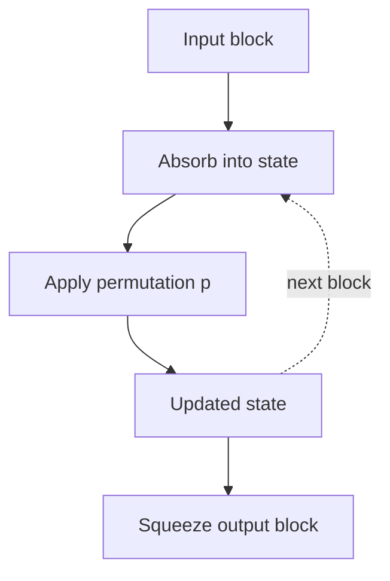
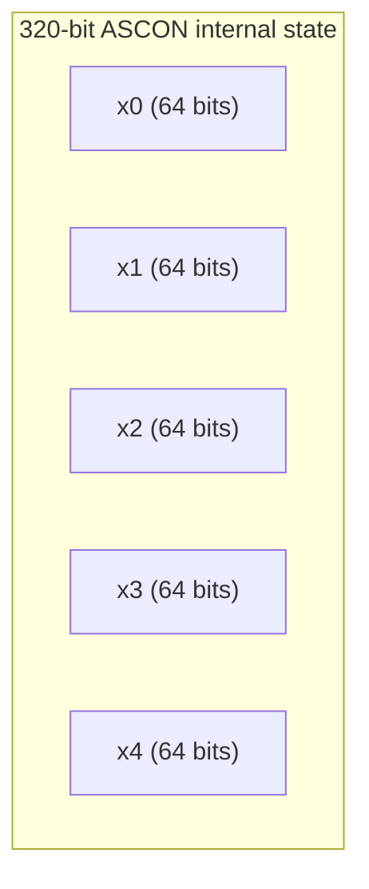
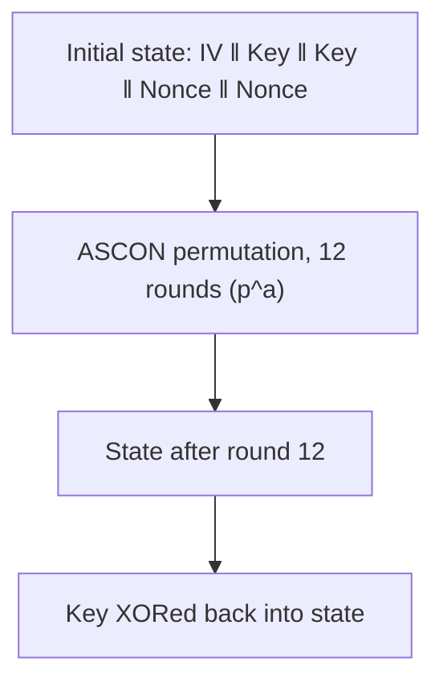
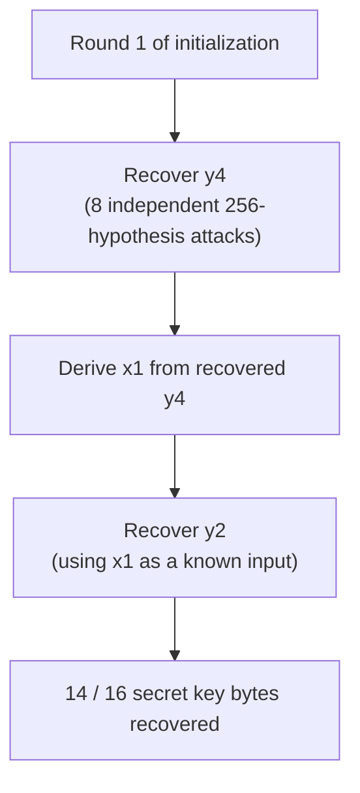

# Chapter 3 — ASCON-128 Architecture

*[← 02 — Background](02_Background.md) · [README](../README.md) · Next: [04 — CPA Theory →](04_CPA_Theory.md)*

---

## 3.1 Why Architecture Matters Before Attacking Anything

Every leakage model derived later in this repository ([Chapter 8](08_Leakage_Model.md)) is a direct Boolean rewrite of a small piece of ASCON's internal round function. None of that derivation is possible without first understanding exactly how ASCON's state is laid out, how it evolves round by round, and — critically — *why* the very first round of initialization is the most attackable point in the entire cipher. This chapter builds that foundation.

Unlike block ciphers such as AES, which transform fixed-size blocks through a sequence of byte-oriented substitution and permutation layers, ASCON is a **permutation-based sponge construction**: a single, large internal state is repeatedly transformed by one fixed permutation, and the algorithm's various modes (initialization, associated-data absorption, encryption, finalization) differ only in *when* and *how* data is XORed into that state — not in the permutation itself.

## 3.2 What ASCON Is and Why NIST Chose It

ASCON is a family of lightweight authenticated encryption and hashing algorithms, selected in February 2023 by the National Institute of Standards and Technology as the winner of its multi-year **Lightweight Cryptography (LWC)** standardization process — the process specifically intended to produce cryptography suitable for devices too constrained to comfortably run AES-GCM or SHA-256.

ASCON-128 provides **Authenticated Encryption with Associated Data (AEAD)**: it simultaneously provides confidentiality (via encryption) and integrity/authenticity (via a MAC-like tag), while targeting a small code and RAM footprint appropriate for:

- Internet of Things (IoT) endpoints
- Wireless sensor networks
- Automotive electronic control units
- RFID and contactless tokens
- Implantable and wearable medical devices
- Industrial embedded controllers

These are, not coincidentally, precisely the class of devices most likely to fall into an attacker's hands — which is exactly why implementation-level security (the subject of this repository) matters as much for ASCON as its underlying algorithmic security.

## 3.3 ASCON-128 Parameters

| Parameter | Value |
|---|---:|
| Key size | 128 bits |
| Nonce size | 128 bits |
| Authentication tag size | 128 bits |
| Internal state size | 320 bits |
| Rate | 64 bits |
| Capacity | 256 bits |
| Initialization rounds (`p^a`) | 12 |
| Intermediate (associated data / plaintext) rounds (`p^b`) | 6 |
| Finalization rounds (`p^a`) | 12 |

*(Values reflect the ASCON-128 parameter set from the finalized NIST specification. Earlier draft versions of ASCON used slightly different round counts and rate/capacity splits — always check the exact version your target firmware implements before deriving leakage equations from it, since the initialization vector and round schedule are version-specific.)*

## 3.4 The Sponge Construction

Instead of processing independent fixed-size blocks like a block cipher, a sponge construction repeatedly **absorbs** data into a state and later **squeezes** output back out, applying the same permutation between every absorb/squeeze step:



The same permutation `p` is reused across every phase of ASCON — initialization, associated-data processing, plaintext encryption, and finalization — with the number of rounds and the exact absorption pattern differing per phase. This project attacks the permutation as it runs during **initialization**, before any plaintext has been touched.

## 3.5 The 320-bit Internal State

ASCON's complete internal state is 320 bits, organized as five 64-bit words:



Every round of the ASCON permutation reads and rewrites all five words simultaneously. The attack in this repository specifically targets intermediate values produced *inside* the substitution layer of the very first application of this permutation.

## 3.6 State Initialization

Before the first permutation call, the state words are loaded as:

```text
x0 ← Initialization Vector (IV)
x1 ← Key[0:63]      (upper 64 bits of the 128-bit key)
x2 ← Key[64:127]    (lower 64 bits of the 128-bit key)
x3 ← Nonce[0:63]    (upper 64 bits of the 128-bit nonce)
x4 ← Nonce[64:127]  (lower 64 bits of the 128-bit nonce)
```

The Initialization Vector (IV) is a fixed, public constant that encodes the algorithm's parameters — key length, rate, and round counts — so that different ASCON variants (ASCON-128 vs. ASCON-128a, for example) never collide on the same state. For ASCON-128, the IV byte string is:

```text
80 40 0C 06 00 00 00 00
```

represented in the analysis code as:

```python
IV_BYTES = np.array(
    [0x80, 0x40, 0x0C, 0x06, 0x00, 0x00, 0x00, 0x00],
    dtype=np.uint8,
)
```

Because the IV is fully public and constant, and the nonce is public and known to the attacker for every trace, **the only unknown quantity in the initial state is the key** — which is precisely the structure a chosen/known-plaintext-style statistical attack like CPA needs to exploit.

## 3.7 The Initialization Phase



This phase mixes the secret key and the public nonce together before any associated data or plaintext is absorbed. **This project focuses exclusively on the very first of these twelve rounds** — the reasoning for that choice is developed in §3.12.

## 3.8 One Round of the ASCON Permutation

Each round of the permutation applies three transformations in sequence:


### Round constant addition

At the start of each round, a round-specific constant is XORed into one state word:

```text
x2 ← x2 ⊕ RC
```

Round constants are what makes each of the twelve rounds behave differently, preventing any rotational or repeating symmetry from being exploitable.

### Nonlinear substitution layer

This is ASCON's only source of nonlinearity, and it is where every leakage model in this repository is derived from. Unlike AES's byte-oriented S-box (a 256-entry lookup table), ASCON implements its S-box as a **bit-sliced Boolean circuit** built entirely from AND, XOR, and NOT gates, applied identically and independently to every one of the 64 bit-positions across the five state words:

```text
(x0, x1, x2, x3, x4)  →  ASCON S-box  →  (y0, y1, y2, y3, y4)
```

The outputs `y0`–`y4` are the intermediate variables this project's leakage models are built around — specifically `y4` and `y2`, as derived in [Chapter 8](08_Leakage_Model.md). Because the substitution is purely Boolean rather than a lookup table, there is no way to "borrow" an S-box-output leakage model from existing AES literature; each equation has to be expanded and simplified by hand from ASCON's published bit-sliced formulas.

### Linear diffusion layer

Following substitution, each of the five state words undergoes a linear diffusion step consisting of XORs with two rotated copies of itself:

```text
xi ← xi ⊕ ROTR(xi, a) ⊕ ROTR(xi, b)
```

where the rotation amounts `a` and `b` are fixed, word-specific constants defined by the ASCON specification. This diffusion layer is what rapidly spreads a single bit's influence across the entire 320-bit state over successive rounds — and it is exactly what makes attacking anything *beyond* the first round dramatically harder, as discussed next.

## 3.9 Why the First Round Is the Attackable Point

The first initialization round offers several properties that make it uniquely tractable for a hand-derived Boolean leakage model:

- The secret key has *just* been loaded into the state and has not yet been mixed by any prior round.
- The nonce — the other input at this stage — is entirely public and known to the attacker.
- Diffusion has not yet had a chance to spread information from the key across unrelated state bits.
- The resulting intermediate values (`y0`–`y4`) can still be written as relatively short, closed-form Boolean expressions of a *single* key byte plus known constants.
- Consequently, the hypothesis space per attacked byte stays at a manageable 256 candidates, and each candidate's predicted leakage can be computed directly from a short equation rather than by simulating the cipher forward.

Every round after the first mixes state words that already depend on multiple key bits each, which would force any leakage model to hypothesize over *combinations* of key bits rather than one byte at a time — a combinatorial explosion this project deliberately avoids by staying at Round 1.

## 3.10 Attack Strategy Preview



This progressive strategy — attack one Boolean intermediate, use its recovery to unlock the *next* intermediate's leakage model — is the backbone of the entire project and is developed formally in [Chapter 8](08_Leakage_Model.md) and executed in [Chapter 9](09_CPA_Attack.md).

## 3.11 Chapter Summary

This chapter walked through ASCON-128's sponge construction, its 320-bit five-word internal state, the structure of one permutation round, and — most importantly — the specific reasons the *first* initialization round is the point at which a hand-derived Boolean leakage model remains tractable. The next chapter steps back from ASCON specifically and develops the general statistical machinery of Correlation Power Analysis: leakage models, hypothesis matrices, and the Pearson correlation distinguisher that is used, byte by byte, throughout the rest of this repository.

---

*Next: [Chapter 4 — Correlation Power Analysis Theory](04_CPA_Theory.md)*
