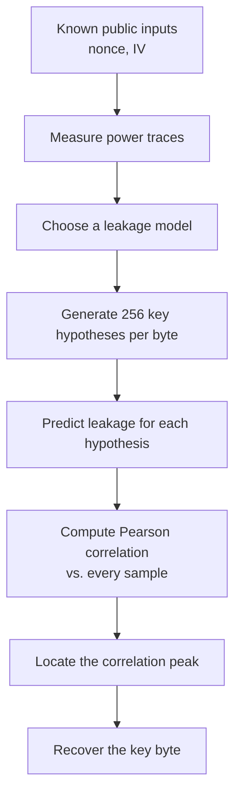

# Chapter 4 — Correlation Power Analysis Theory

*[← 03 — ASCON Architecture](03_ASCON_Architecture.md) · [README](../README.md) · Next: [05 — Experimental Setup →](05_Experimental_Setup.md)*

---

## 4.1 From Physical Leakage to a Statistical Distinguisher

[Chapter 2](02_Background.md) established *why* power leaks and *what* a leakage model predicts. This chapter turns that qualitative intuition into the precise statistical procedure — Correlation Power Analysis — that is actually implemented in [Chapter 9](09_CPA_Attack.md). Everything here is cipher-agnostic; ASCON-specific equations don't appear until [Chapter 8](08_Leakage_Model.md). Understanding this chapter in isolation is enough to run CPA against any implementation, given a suitable leakage model.

## 4.2 Where CPA Sits Among Power Analysis Techniques

Power analysis is generally organized into three increasingly powerful (and increasingly data-hungry) categories:

| Technique | Uses | Distinguishes correct key by |
|---|---|---|
| **Simple Power Analysis (SPA)** | A single trace (or very few) | Visually/directly recognizable patterns — branches, loop counts, distinct instruction sequences |
| **Differential Power Analysis (DPA)** | Many traces, split into two groups | The *difference* in average power between a "guessed bit = 0" group and a "guessed bit = 1" group |
| **Correlation Power Analysis (CPA)** | Many traces, one continuous predictor per hypothesis | The **Pearson correlation coefficient** between a hypothesized leakage value and the measured power, across all traces |

CPA generalizes DPA's binary grouping into a continuous, ranked statistic, which typically gives it a sharper distinguishing signal and better resolution for a given number of traces. It is the technique used throughout this project.



## 4.3 The Trace Matrix

Assume `N` measured traces, each with `M` samples. The acquired data is naturally represented as a matrix:

$$T \in \mathbb{R}^{N \times M}$$

where row `k` is the `k`-th encryption's full power trace, and column `i` is the value of sample `i` across all `N` encryptions. For this project, `N = 3000` and `M = 2048` (see [Chapter 5](05_Experimental_Setup.md) and [Chapter 7](07_Trace_Capture.md) for the acquisition details behind these numbers).

## 4.4 The Hamming Weight Leakage Model

The Hamming Weight of an `n`-bit value is simply the count of its '1' bits:

$$HW(x) = \sum_{i=0}^{n-1} x_i, \qquad x_i \in \{0, 1\}$$

For example, `HW(0b10110100) = 4`. The modeling assumption — introduced in [§2.4](02_Background.md#24-leakage-models-turning-physics-into-a-statistical-predictor) — is that processing a value with a higher Hamming Weight tends to produce measurably higher instantaneous power draw than processing one with a lower Hamming Weight, because more bits are being driven to a '1' state. This is an approximation of real hardware behavior, but as demonstrated in [Chapter 10](10_Results.md), it is accurate enough to recover most of a real secret key from a real device.

## 4.5 Hypothesis Generation

For a targeted key byte, the true value is unknown, so **every** possible value must be tested independently:

$$k \in \{0x00, 0x01, \dots, 0xFE, 0xFF\}, \qquad |k| = 2^8 = 256$$

For each of these 256 hypotheses, and for each trace (whose known nonce and IV bytes differ from trace to trace), the corresponding ASCON intermediate value is computed from the Boolean leakage equation ([Chapter 8](08_Leakage_Model.md)), and its Hamming Weight becomes that hypothesis's predicted leakage for that trace:

```text
known nonce byte + known IV byte + key hypothesis  →  intermediate value  →  Hamming Weight  →  predicted leakage
```

## 4.6 The Hypothesis Matrix

Collecting these predictions across all `N` traces and all 256 hypotheses produces a hypothesis matrix:

$$H \in \mathbb{R}^{N \times 256}$$

where row `k`, column `g` holds the predicted leakage for key guess `g` given the known nonce used in trace `k`. This matrix is generated once per attacked key byte and is entirely independent of the *measured* power — it depends only on public information (the nonce) plus a guessed key byte.

## 4.7 Pearson Correlation as the Distinguisher

For a single key guess `g`, column `g` of the hypothesis matrix is a vector of `N` predicted leakage values, one per trace. This vector is compared against **every sample column** of the measured trace matrix `T` using the Pearson correlation coefficient:

$$\rho(X, Y) = \frac{\sum_i (X_i - \bar{X})(Y_i - \bar{Y})}{\sqrt{\sum_i (X_i - \bar{X})^2} \sqrt{\sum_i (Y_i - \bar{Y})^2}}$$

where `X` is the predicted-leakage column for guess `g` and `Y` is one sample column of `T`. The coefficient is bounded, $-1 \le \rho \le 1$:

| Value | Interpretation |
|---:|---|
| +1 | Perfect positive linear correlation |
| 0 | No linear relationship |
| −1 | Perfect negative linear correlation |

The **correct key hypothesis is expected to produce the largest absolute correlation**, at the specific sample where the targeted intermediate value is actually processed by the device.

## 4.8 The Correlation Matrix

Repeating this comparison for all 256 hypotheses against all `M` (or a reduced window of) samples produces a correlation matrix:

$$C \in \mathbb{R}^{256 \times M}$$

where row `g`, column `i` holds $\rho\big(H_{:,g},\, T_{:,i}\big)$ — the correlation between guess `g`'s predicted leakage and the measured power at sample `i`, across all `N` traces simultaneously. Visualized as a heatmap (key guess on one axis, sample index on the other), the correct key hypothesis typically appears as a distinct horizontal band of high correlation magnitude. Figures 6 and 7 in [Chapter 9](09_CPA_Attack.md#94-correlation-heatmaps) show exactly this for the `y4` and `y2` attacks in this project.

## 4.9 Locating the Correlation Peak

For every key hypothesis `g`, its best-case correlation across all samples is:

$$\rho_{\max}(g) = \max_i |\rho(g, i)|$$

and the recovered key is the hypothesis that maximizes this quantity:

$$k^{*} = \arg\max_{g} \rho_{\max}(g), \qquad i^{*} = \arg\max_{i} |\rho(k^{*}, i)|$$

`k*` is the recovered key byte; `i*` is the sample at which that byte's targeted intermediate value actually leaks — which is exactly the localization step used to build the compact attack windows described in [Chapter 7](07_Trace_Capture.md#713-selecting-the-active-window) and [Chapter 9](09_CPA_Attack.md#911-attack-window).

## 4.10 Variance Is Not Correlation

A subtlety that materially affected the methodology of this project (documented in full in [Chapter 7](07_Trace_Capture.md) and [Chapter 11](11_Limitations.md)) is that **variance and correlation answer different questions**:

| Statistic | Answers |
|---|---|
| **Variance**, $\mathrm{Var}(i) = \frac{1}{N}\sum_k (T_{k,i} - \mu_i)^2$ | *Where* does the device switch a lot? |
| **CPA correlation**, $\rho(g, i)$ | *Where* does the switching activity depend on the secret key specifically? |

A sample can have very high variance simply because unrelated computation (communication overhead, unrelated firmware logic, background switching noise) happens to be active there — none of which depends on the key. Consequently:

$$\text{sample of maximum variance} \;\neq\; \text{sample of maximum key-dependent correlation}$$

**in general**, and this project found exactly that in practice. Variance analysis is therefore used only as a cheap first pass to narrow down the *region* worth searching; correlation is what actually identifies the *precise* leakage point and the correct key. Conflating the two — trusting the variance peak as the attack point — is a common mistake this project deliberately avoids.

## 4.11 First-Order CPA: Scope and Assumptions

This work performs a **first-order** attack: at any given moment, only a *single* intermediate variable is modeled and correlated against the trace. This implicitly assumes the target implementation applies **no masking or other first-order countermeasure** — an assumption confirmed by [Chapter 6](06_Firmware_Modifications.md), since the masked ASCON firmware could not be built for this target and the unmasked reference implementation was used instead. Against a properly masked implementation, first-order CPA as described here would not succeed, and a higher-order attack (correlating *combinations* of intermediate shares) would be required instead — a natural extension discussed in [Chapter 12](12_Development_Journey.md#future-work).

## 4.12 Why CPA Was the Right Tool Here

Compared to the alternatives introduced in §4.2, CPA was chosen because it:

- requires only **known public inputs** (the nonce) and measured power — no profiling device or second identical target is needed;
- is **computationally efficient** thanks to vectorized correlation computation across the entire hypothesis matrix at once;
- performs well against **unprotected** software implementations, which is exactly the target here;
- simultaneously delivers **both** key recovery *and* leakage localization, which matters given that the precise leakage sample was not known in advance for a Boolean cipher with no prior CPA literature to reference.

## 4.13 Chapter Summary

This chapter developed the statistical core of the entire project: the Hamming Weight leakage model, hypothesis-matrix construction, Pearson correlation as a distinguisher, and the important distinction between locating an *active* region (variance) and locating the *leaking* sample (correlation). [Chapter 5](05_Experimental_Setup.md) now turns to the concrete hardware and software setup used to actually acquire the trace matrix `T` this theory operates on.

---

*Next: [Chapter 5 — Experimental Setup](05_Experimental_Setup.md)*
