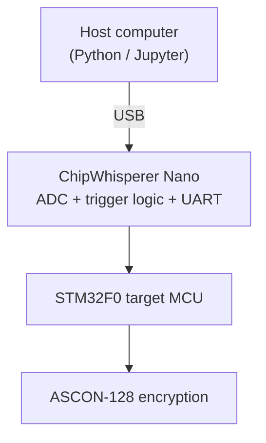
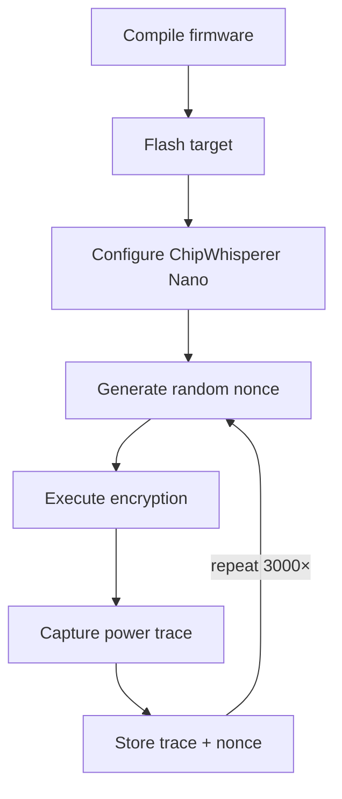

# Chapter 5 — Experimental Setup

*[← 04 — CPA Theory](04_CPA_Theory.md) · [README](../README.md) · Next: [06 — Firmware Modifications →](06_Firmware_Modifications.md)*

---

## 5.1 Goal of This Chapter

Everything statistical in [Chapter 4](04_CPA_Theory.md) depends on having a clean, well-synchronized, high-quality trace matrix `T` to operate on. This chapter documents exactly how that matrix was produced: the physical setup, the software stack, and the acquisition parameters chosen — and why.

## 5.2 Experimental Platform



The host computer drives the entire experiment: it generates each random nonce, transmits it to the target over the ChipWhisperer Nano's UART (SimpleSerial) bridge, arms the capture, and stores the resulting trace. The Nano itself performs two jobs simultaneously — it forwards commands/responses between host and target, and it digitizes the target's power-supply current during the window bracketed by the firmware's trigger signal (see [§5.7](#57-trigger-configuration)).

## 5.3 Hardware

| Component | Description |
|---|---|
| Capture device | ChipWhisperer Nano |
| Target MCU | STM32F0 (ARM Cortex-M0), onboard the Nano |
| Communication | UART, SimpleSerial protocol |
| Trigger | GPIO trigger line, asserted by firmware |
| Host system | PC running the ChipWhisperer Python API |

The ChipWhisperer Nano was deliberately chosen as the platform for this project: it is the least expensive member of the ChipWhisperer family, integrates the capture ADC, trigger logic, and target MCU onto a single low-cost board, and is explicitly marketed as an educational entry point into side-channel analysis. Demonstrating that a meaningful fraction of a real key can be recovered on *this* tier of hardware — rather than a lab-grade oscilloscope setup — is part of the point of this project: side-channel attacks are not an exotic, resource-intensive threat reserved for nation-state adversaries.

## 5.4 Software Environment

| Software | Purpose |
|---|---|
| ChipWhisperer (Python API) | Trace acquisition, target communication |
| Jupyter Notebook | Interactive experimentation and analysis (`jupyter/ascon_cpa.ipynb`) |
| NumPy | Vectorized numerical computation for hypothesis matrices and correlation |
| Matplotlib | All figures in this repository (`figures/`) |
| ARM GCC (`arm-none-eabi-gcc`) | Cross-compiling the target firmware |

## 5.5 Target Firmware Source

The firmware is based on the **official ASCON SimpleSerial implementation**:

> https://github.com/ascon/simpleserial-ascon

This upstream repository provides several ASCON-128 variants, including both an unprotected reference implementation and masked, side-channel-hardened variants:

```text
Implementations/
└── crypto_aead/
    └── ascon128v12/
        ├── protected_bi32_armv6/
        ├── protected_bi32_armv6_leveled/
        └── ref/
```

The masked implementation was the *original* target of this project, since attacking a protected implementation would have been a more advanced (and arguably more interesting) exercise. As documented fully in [Chapter 6](06_Firmware_Modifications.md), it could not be successfully built for the ChipWhisperer Nano target, and the project pivoted to the unprotected `ref/` implementation — which is what the attack in this repository actually targets.

## 5.6 Firmware Build Configuration

```python
PLATFORM      = "CWNANO"
SCOPETYPE     = "CWNANO"
CRYPTO_TARGET = "NONE"

SS_VER    = "SS_VER_1_1"
SS_SHARED = 0

DATA_LEN  = 190
RESP_LEN  = 96
```

| Setting | Meaning |
|---|---|
| `PLATFORM = CWNANO` | Builds firmware for the STM32F0 target integrated on the Nano |
| `SCOPETYPE = CWNANO` | Matches the acquisition software to the Nano's capture hardware |
| `CRYPTO_TARGET = NONE` | ASCON already provides its own crypto routines; no external crypto library target is needed |
| `SS_VER = SS_VER_1_1` | The lightweight SimpleSerial protocol version, sufficient for transmitting key/nonce/plaintext/ciphertext without extra protocol overhead |
| `SS_SHARED = 0` | Disables the masked "shared" API expected by the protected firmware variants (see [Chapter 6](06_Firmware_Modifications.md)) |
| `DATA_LEN = 190`, `RESP_LEN = 96` | Communication buffer sizes, sized to fit ASCON's key/nonce/associated-data/ciphertext payloads within the Nano's limited RAM |

## 5.7 Trigger Configuration

Accurate trace alignment across thousands of acquisitions requires a hardware trigger tightly bracketing *only* the operation under analysis:

```c
trigger_high();
crypto_aead_encrypt(...);
trigger_low();
```

The Nano begins sampling on the trigger's rising edge and stops shortly after its falling edge, so every recorded trace starts at (approximately) the same point in the encryption routine — a prerequisite for the sample-wise statistics computed throughout [Chapter 4](04_CPA_Theory.md) to be meaningful across traces.

## 5.8 Acquisition Parameters

| Parameter | Value |
|---|---:|
| Number of traces | 3,000 |
| Samples per trace | 2,048 |
| Secret key | Fixed across all traces |
| Public nonce | Freshly randomized per trace |
| Trigger | GPIO, firmware-controlled |
| Target algorithm | ASCON-128 |

**Why a fixed key and a random nonce?** CPA's statistical machinery ([Chapter 4](04_CPA_Theory.md)) specifically requires that the *unknown* quantity (the key) stay constant while a *known* quantity (the nonce) varies across measurements, so that differences in measured power can be attributed to the interaction between the (fixed) key and the (varying, known) nonce. Randomizing the nonce is also what ASCON's own security model requires in normal operation, so this setup mirrors a realistic deployment rather than an artificially favorable one for the attacker.

## 5.9 Acquisition Procedure

For each of the 3,000 traces:

1. Generate a fresh random 128-bit nonce on the host.
2. Transmit the nonce and encryption command to the target over SimpleSerial.
3. Firmware raises the trigger line.
4. Target executes `crypto_aead_encrypt(...)`.
5. Firmware lowers the trigger line.
6. Nano's ADC output (the power trace) is read back and stored.
7. The nonce, ciphertext, and trace are all stored together for that acquisition.

## 5.10 Resulting Dataset Shape

The complete acquisition produces two matrices used throughout the rest of this repository:

$$T \in \mathbb{R}^{3000 \times 2048} \qquad\qquad N \in \mathbb{Z}^{3000 \times 16}$$

`T` is the trace matrix (one row per encryption, one column per sampled instant); `N` is the corresponding nonce matrix (one row per encryption, sixteen known nonce bytes per row). The ciphertext produced by each encryption is also stored, purely as a sanity check that the target executed successfully — the CPA attack itself in [Chapter 9](09_CPA_Attack.md) uses only `T` and `N`.

## 5.11 Acquisition Workflow



## 5.12 Chapter Summary

This chapter described the complete acquisition setup: an STM32F0 target executing the unprotected ASCON-128 reference implementation, instrumented via a ChipWhisperer Nano under a fixed key / random nonce regime. The result is a 3,000 × 2,048 trace matrix, paired with the known nonces, that forms the raw input to every subsequent chapter. [Chapter 6](06_Firmware_Modifications.md) backs up one step to explain *why* the firmware ended up looking the way it does — including the masked-implementation build failures that shaped this final configuration.

---

*Next: [Chapter 6 — Firmware Modifications](06_Firmware_Modifications.md)*
