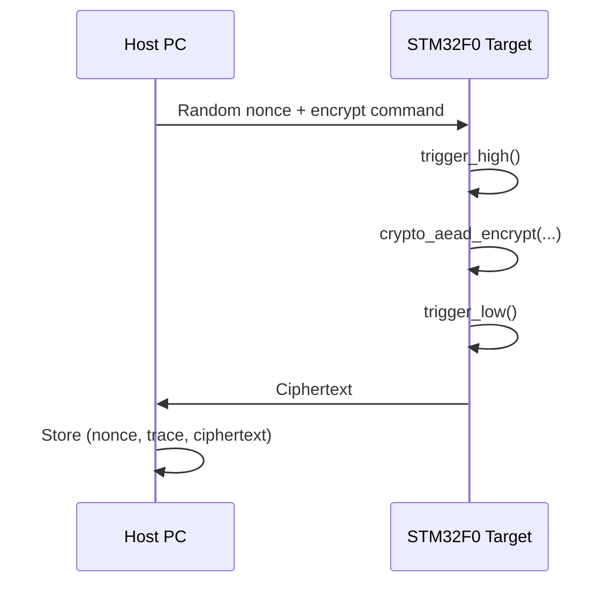

# Chapter 6 — Firmware Modifications

*[← 05 — Experimental Setup](05_Experimental_Setup.md) · [README](../README.md) · Next: [07 — Trace Capture →](07_Trace_Capture.md)*

---

## 6.1 Why This Chapter Exists

The final firmware configuration summarized in [§5.6](05_Experimental_Setup.md#56-firmware-build-configuration) did not come from reading the SimpleSerial documentation once and compiling successfully on the first try. It came from an initial attempt to target the *protected* ASCON implementation, a build failure that took real debugging effort to diagnose, and a deliberate pivot to the unprotected reference implementation actually attacked in this repository. Documenting that path honestly — including the dead end — is more useful to a future reader attempting the same project than pretending the final configuration was obvious from the start.

## 6.2 Available Implementations Upstream

The official ASCON SimpleSerial repository (`https://github.com/ascon/simpleserial-ascon`) ships several ASCON-128 implementation variants side by side:

```text
Implementations/
└── crypto_aead/
    └── ascon128v12/
        ├── protected_bi32_armv6/            ← masked, side-channel hardened
        ├── protected_bi32_armv6_leveled/     ← masked, leveled variant
        └── ref/                              ← portable, unprotected reference C code
```

## 6.3 First Attempt: `protected_bi32_armv6`

The initial objective was to target `protected_bi32_armv6`, which implements **Boolean masking** specifically to resist first-order power analysis of the kind developed in [Chapter 4](04_CPA_Theory.md) — attacking it would have demonstrated whether this project's methodology could be extended to defeat a *hardened* target, not just an unprotected one.

Compiling this variant for the ChipWhisperer Nano surfaced several build-time failures:

- **Missing shared encryption routines** — the masked implementation expects a "shared-value" API (functions operating on secret-shared inputs) that the CWNANO SimpleSerial harness does not provide out of the box.
- **Linker errors**, most consistently unresolved references to:

  ```text
  crypto_aead_encrypt_shared()
  crypto_aead_decrypt_shared()
  ```

- **Build configuration incompatibilities** between the masked implementation's expected toolchain flags and the CWNANO target's Makefile defaults.
- **Implementation dependencies** (helper routines for share generation/refreshing) not satisfied by the firmware environment available for this target.

Multiple attempts to patch the build configuration — supplying stub implementations of the missing shared routines, adjusting compiler flags, and cross-checking against the `leveled` variant — did not produce a firmware image that would link successfully for the Nano's constrained target environment.

## 6.4 Pivoting to the Reference Implementation

Since the core objective of this project was to demonstrate a **first-order CPA attack** (§4.11), and the reference implementation is a perfectly valid — and arguably more instructive — target for exactly that attack class, the project switched to:

```text
Implementations/
└── crypto_aead/
    └── ascon128v12/
        └── ref/
```

This implementation is portable C with no masking, no shared-value API, and no non-standard build dependencies — it compiled cleanly for CWNANO on the first attempt. Its lack of countermeasures is precisely *why* it is vulnerable to the attack demonstrated in this repository, and its simplicity is why the leakage models in [Chapter 8](08_Leakage_Model.md) could be derived directly from its Boolean operations without fighting the build system at the same time.

## 6.5 Firmware Configuration, Parameter by Parameter

The final configuration (repeated from [§5.6](05_Experimental_Setup.md#56-firmware-build-configuration) for context) is:

```python
PLATFORM      = "CWNANO"
SCOPETYPE     = "CWNANO"
CRYPTO_TARGET = "NONE"

SS_VER    = "SS_VER_1_1"
SS_SHARED = 0

DATA_LEN  = 190
RESP_LEN  = 96
```

- **`PLATFORM = CWNANO`** targets the STM32F0 integrated on the Nano board specifically, rather than a generic ARM target.
- **`SCOPETYPE = CWNANO`** ensures the acquisition-side Python API talks to the Nano's specific capture hardware rather than a different ChipWhisperer scope model.
- **`CRYPTO_TARGET = NONE`** disables ChipWhisperer's own bundled crypto-target libraries, since ASCON's reference implementation is entirely self-contained.
- **`SS_VER = SS_VER_1_1`** selects a lightweight SimpleSerial protocol version sufficient for this project's key/nonce/plaintext/ciphertext exchange, avoiding the extra protocol machinery introduced in later SimpleSerial versions that this project does not need.
- **`SS_SHARED = 0`** is the change directly downstream of §6.3 and §6.4 — it disables the masked "shared" execution path entirely, so the firmware calls the plain `crypto_aead_encrypt()` entry point instead of `crypto_aead_encrypt_shared()`, matching the reference implementation's actual API.
- **`DATA_LEN = 190`, `RESP_LEN = 96`** size the SimpleSerial input/response buffers to comfortably fit ASCON-128's key, nonce, associated data, and ciphertext within the Nano's limited SRAM, without over-allocating buffer space the target can't spare.

## 6.6 Trigger Placement in the Encryption Routine

```c
trigger_high();
crypto_aead_encrypt(...);
trigger_low();
```

Only the encryption call itself is bracketed by the trigger; anything the firmware does before or after — receiving the command, parsing input, transmitting the response — is deliberately excluded from the captured window, keeping every trace focused on the cryptographic computation rather than communication overhead.

## 6.7 Per-Acquisition Communication Flow



This sequence repeats 3,000 times to build the dataset described in [Chapter 5](05_Experimental_Setup.md#59-acquisition-procedure).

## 6.8 Fixed Key, Random Nonce — Enforced at the Firmware Level

The secret key is programmed once and held constant across the entire acquisition campaign, while a fresh random nonce is generated by the host for every single trace. This is the firmware-level realization of the CPA precondition discussed in [§5.8](05_Experimental_Setup.md#58-acquisition-parameters): any variation observed in the measured power must come from the (known) nonce interacting with the (fixed, unknown) key — never from the key itself changing.

## 6.9 Why the Reference Implementation Is Exploitable

The reference implementation computes every intermediate value directly, on unmasked state words, using ordinary machine instructions. Consequently:

- every intermediate value the algorithm computes is a direct, deterministic function of the secret key and known public inputs;
- the microcontroller processes those values with no randomization, blinding, or secret-sharing applied;
- the Hamming Weight of those values is therefore observable, at least approximately, through the target's instantaneous power consumption.

This is exactly the precondition first-order CPA needs, and it is the reason this project's methodology — attacking `ref/` rather than the masked variants — succeeds at all.

## 6.10 Chapter Summary

This chapter traced the firmware's development path from an initial (unsuccessful) attempt at the masked ASCON implementation, through the specific linker and build failures encountered, to the final unprotected reference-implementation configuration actually used for acquisition. That firmware, running on the STM32F0 target described in [Chapter 5](05_Experimental_Setup.md), is what produces the power traces analyzed starting in [Chapter 7](07_Trace_Capture.md).

---

*Next: [Chapter 7 — Power Trace Acquisition](07_Trace_Capture.md)*
