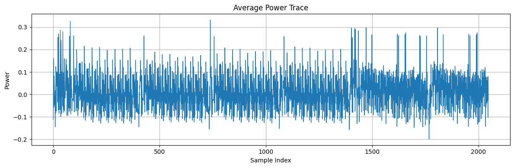
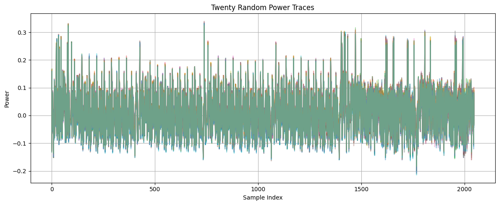
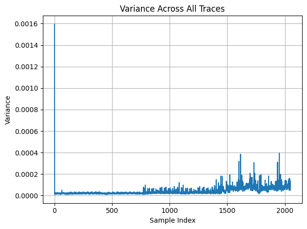
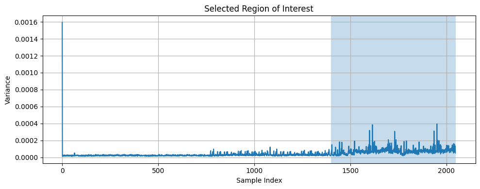

# Chapter 7 — Power Trace Acquisition

*[← 06 — Firmware Modifications](06_Firmware_Modifications.md) · [README](../README.md) · Next: [08 — Leakage Model →](08_Leakage_Model.md)*

---

## 7.1 Why Trace Quality Comes Before Statistics

Every equation in [Chapter 4](04_CPA_Theory.md) assumes that sample index `i` in trace `k` corresponds to *the same physical moment* of execution as sample index `i` in every other trace. If that alignment assumption breaks down — because of jitter, inconsistent trigger timing, or excessive noise — no amount of correlation math will recover a meaningful key. This chapter covers how the 3,000-trace dataset introduced in [Chapter 5](05_Experimental_Setup.md) was inspected, characterized, and narrowed down to the region actually worth attacking.

## 7.2 Acquisition Recap

For every one of the 3,000 acquisitions: a fresh random nonce was generated, the fixed key stayed constant, the target executed one ASCON-128 encryption bracketed by the trigger, and the ChipWhisperer Nano recorded the resulting power trace. Full detail on this loop is in [§5.9](05_Experimental_Setup.md#59-acquisition-procedure); this chapter picks up once the raw dataset — `trace_array`, shape `(3000, 2048)` — already exists in memory.

## 7.3 First Look: The Average Trace

Before any statistical attack, the simplest possible sanity check is to plot the mean of all captured traces:

```python
mean_trace = np.mean(trace_array, axis=0)

plt.figure(figsize=(12, 4))
plt.plot(mean_trace, linewidth=1)
plt.xlabel("Sample Index")
plt.ylabel("Power")
plt.title("Average Power Trace")
plt.grid(True)
plt.tight_layout()
plt.show()
```

<p align="center"></p>
<p align="center"><em>Figure 1 — Mean of 3,000 acquired power traces. Distinct activity regions correspond to communication overhead, the ASCON permutation itself, and idle/return-to-host phases.</em></p>

This single plot confirms the acquisition pipeline is working end-to-end — a flat, featureless trace here would indicate a trigger, wiring, or gain-configuration problem long before any CPA math is worth attempting.

## 7.4 A Qualitative Look: Random Individual Traces

Averaging can hide trace-to-trace variability that matters for later analysis, so a small random sample of raw (non-averaged) traces is also useful:

```python
plt.figure(figsize=(12, 5))
for i in np.random.choice(trace_array.shape[0], 20, replace=False):
    plt.plot(trace_array[i], alpha=0.4)
plt.xlabel("Sample Index")
plt.ylabel("Power")
plt.title("Twenty Random Power Traces")
plt.grid(True)
plt.tight_layout()
plt.show()
```

<p align="center"></p>
<p align="center"><em>Figure 3 — Twenty individually plotted traces (not averaged), overlaid with partial transparency. Consistent envelope shape across traces is a good sign for alignment quality; trace-to-trace spread within that envelope reflects real, data-dependent variation the CPA attack is designed to exploit.</em></p>

## 7.5 Variance Analysis: Finding *Where* the Device Is Busy

The mean trace shows overall shape but not *which* samples vary meaningfully from trace to trace — and it's exactly that variability that CPA needs to have something to correlate against. The next step computes, for every sample index `i`, the variance across all 3,000 traces:

$$\mathrm{Var}(i) = \frac{1}{N} \sum_{k=1}^{N} \left(T_{k,i} - \mu_i\right)^2$$

```python
variance = np.var(trace_array, axis=0)

plt.figure(figsize=(12, 4))
plt.plot(variance)
plt.xlabel("Sample Index")
plt.ylabel("Variance")
plt.title("Variance Across 3000 Power Traces")
plt.grid(True)
plt.tight_layout()
plt.show()
```

<p align="center"></p>
<p align="center"><em>Figure 2 — Per-sample variance across the full 2,048-sample trace. The pronounced region of elevated variance is where meaningful computational (switching) activity is concentrated.</em></p>

## 7.6 Why a Fixed Key and Random Nonces Matter Here Specifically

[§5.8](05_Experimental_Setup.md#58-acquisition-parameters) already explained *why* the acquisition uses a fixed key and random nonces for CPA in general. It matters again here for a subtler reason: because the nonce enters the state directly during initialization (see [§3.6](03_ASCON_Architecture.md#36-state-initialization)), varying the nonce is *what produces* the trace-to-trace variance visible in Figure 2 within the initialization region in the first place. Without a varying known input, the traces would look far more uniform, and there would be nothing for CPA's correlation step to statistically exploit.

## 7.7 Selecting the Active Region of Interest

Inspecting the variance trace shows that the majority of cryptographically relevant switching activity — corresponding to the ASCON initialization permutation — falls approximately between samples **1,400 and 2,050**:

```python
variance = np.var(trace_array, axis=0)

plt.figure(figsize=(12, 4))
plt.plot(variance)
plt.axvspan(1400, 2050, alpha=0.25)
plt.xlabel("Sample Index")
plt.ylabel("Variance")
plt.title("Selected Region of Interest")
plt.grid(True)
plt.tight_layout()
plt.show()
```

<p align="center"></p>
<p align="center"><em>Figure 4 — The shaded band (samples 1,400–2,050) marks the region retained for further analysis; everything outside it is discarded before the CPA attack in Chapter 9.</em></p>

Restricting the trace matrix to this window:

```python
trace_window = trace_array[:, 1400:2050]
```

reduces the analysis from **2,048 samples down to 650**, cutting the computational cost of every subsequent correlation computation roughly by a factor of three without discarding the region that actually matters.

## 7.8 Variance Identifies Activity — Not Leakage

This is the point developed formally in [§4.10](04_CPA_Theory.md#410-variance-is-not-correlation): the variance plot tells you *where the device is doing something*, not *where that something depends on the secret key*. The 650-sample region selected here is a **candidate search space**, not the final attack window. The actual leakage-bearing sample within this window is identified only after running Correlation Power Analysis itself — covered in [Chapter 9](09_CPA_Attack.md#93-leakage-localization-using-cpa) — and it is *not* guaranteed to coincide with the variance maximum. In this project's data, it did not.

## 7.9 Trace and Nonce Datasets Going Forward

After this preprocessing step, the dataset carried into the attack chapters consists of:

- `trace_window`, shape `(3000, 650)` — the reduced power trace matrix,
- the corresponding nonce matrix `N`, shape `(3000, 16)`,
- the fixed (unknown to the attack code) secret key, used only afterward to verify recovered bytes.

## 7.10 Chapter Summary

This chapter walked through the acquired dataset's basic sanity checks (average trace, random trace overlays), computed per-sample variance to locate the region containing the ASCON initialization permutation, and reduced the working dataset from 2,048 to 650 samples accordingly. It also reiterated a point central to this project's methodology: variance narrows the *search space*, but only correlation — computed next, once a leakage model exists — can identify the true leakage-bearing sample. [Chapter 8](08_Leakage_Model.md) now derives that leakage model directly from ASCON's Boolean substitution layer.

---

*Next: [Chapter 8 — Leakage Model Construction](08_Leakage_Model.md)*
