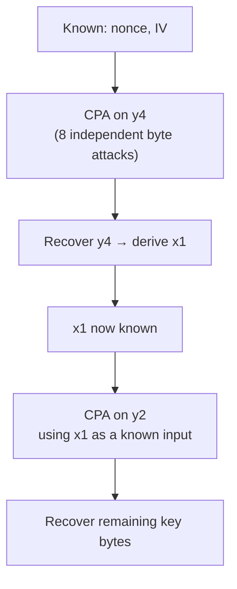

# Chapter 8 — Leakage Model Construction

*[← 07 — Trace Capture](07_Trace_Capture.md) · [README](../README.md) · Next: [09 — CPA Attack →](09_CPA_Attack.md)*

---

## 8.1 The Core Difficulty: ASCON Has No S-Box to Attack

CPA requires a mathematical model that predicts, for every key hypothesis, what internal value the device is processing at a given moment — and that model has to be expressed in terms the attacker already knows (public inputs) plus the one unknown byte being hypothesized. For AES, this is almost mechanical: the first-round S-box output, `SBox(plaintext_byte ⊕ key_byte)`, is a standard, widely reused target.

ASCON offers nothing equivalent. As established in [§3.8](03_ASCON_Architecture.md#38-one-round-of-the-ascon-permutation), its nonlinear layer is a **bit-sliced Boolean circuit**, not a lookup table, applied uniformly across all 64 bit positions of the state. There is no single-byte substitution output to target directly. This chapter derives, from scratch, the Boolean intermediate variables this project attacks instead.

## 8.2 State at the Start of Round 1

Recall from [§3.6](03_ASCON_Architecture.md#36-state-initialization) that immediately before the first permutation call:

```text
x0 ← Initialization Vector   (known)
x1 ← Key[0:63]               (unknown)
x2 ← Key[64:127]             (unknown)
x3 ← Nonce[0:63]             (known, public)
x4 ← Nonce[64:127]           (known, public)
```

At this exact moment, the key has not yet been touched by any diffusion step, so the substitution layer's outputs can still be written as short, closed-form Boolean functions of individual key bits/bytes plus known constants — which is exactly the property [§3.9](03_ASCON_Architecture.md#39-why-the-first-round-is-the-attackable-point) identified as making Round 1 attackable at all.

## 8.3 Why Not Model the Whole 320-bit State at Once?

The full state is 320 bits; attempting to build a single joint hypothesis over that much unknown material is both mathematically unwieldy (the Boolean expressions rapidly stop being expressible per-byte) and computationally infeasible (the hypothesis space would need to cover far more than 256 candidates). Instead, this project selects **individual intermediate variables** whose Boolean expressions depend on:

- exactly **one** unknown key byte,
- **known** nonce bytes,
- **known** IV/constant bytes,

allowing each key byte to be recovered as an *independent* 256-hypothesis CPA sub-attack, repeated across bytes — precisely the strategy previewed in [§3.10](03_ASCON_Architecture.md#310-attack-strategy-preview).

## 8.4 First Target: `y4`

The first intermediate variable attacked is `y4`, one output of the nonlinear substitution layer during Round 1. After expanding and simplifying ASCON's bit-sliced Boolean S-box equations for a single output bit/byte position, the target expression reduces to:

$$y_4 = (x_4 \wedge k) \oplus x_4 \oplus x_3 \oplus (k \wedge x_0) \oplus k$$

| Symbol | Meaning | Known to the attacker? |
|---|---|---|
| $x_0$ | Initialization Vector byte | Yes |
| $x_3$ | Nonce byte | Yes |
| $x_4$ | Nonce byte | Yes |
| $k$ | Secret key byte | **No — the hypothesis variable** |

Every term in this equation is computable for any of the 256 candidate values of `k`, given only the known nonce and IV bytes for that trace — exactly the CPA precondition from [§4.5](04_CPA_Theory.md#45-hypothesis-generation).

## 8.5 The Initialization Vector, Concretely

$$\text{IV} = \texttt{80 40 0C 06 00 00 00 00}$$

```python
IV_BYTES = np.array(
    [0x80, 0x40, 0x0C, 0x06, 0x00, 0x00, 0x00, 0x00],
    dtype=np.uint8,
)
```

Each byte of the IV feeds directly into the `y4` equation as `x0` for the corresponding key byte position.

## 8.6 Building the 256-Hypothesis Set for `y4`

For every trace (with its own known nonce), and for every one of the 256 possible values of `k`:

```text
known nonce (x3, x4) + known IV byte (x0) + key guess k  →  compute y4
```

The Hamming Weight of the resulting `y4` value becomes that hypothesis's predicted leakage for that trace:

$$L(k) = HW(y_4)$$

precomputed efficiently with a lookup table rather than counting bits on the fly:

```python
HW_TABLE = np.array(
    [bin(x).count("1") for x in range(256)],
    dtype=np.float32,
)
```

## 8.7 The Resulting Hypothesis Matrix

Repeating §8.6 across all 3,000 traces and all 256 key guesses produces the hypothesis matrix introduced generically in [§4.6](04_CPA_Theory.md#46-the-hypothesis-matrix):

$$H \in \mathbb{R}^{3000 \times 256}$$

which is then correlated, column by column, against the measured (windowed) power trace matrix — the mechanics of that correlation step are covered in [Chapter 9](09_CPA_Attack.md).

## 8.8 Recovering `y4`, Byte by Byte

Running the CPA procedure from [Chapter 4](04_CPA_Theory.md) independently for each of the 8 key bytes feeding into the `y4` equation recovers the intermediate variable `y4` for the first half of the key. Note that `y4` itself is **not** the final objective — recovering it is a stepping stone toward the next equation.

## 8.9 Using Recovered `y4` to Derive `x1`

Because `y4` was defined as a specific Boolean function of `x0`, `x3`, `x4`, and `k`, and `x0`, `x3`, `x4` are all known while `k` was just recovered, the intermediate state value `x1` can now be reconstructed directly from ASCON's round equations. This is the pivot point of the progressive strategy: **`x1`, previously entirely unknown, is now known** and can be plugged into the *next* leakage equation as a constant.

## 8.10 Second Target: `y2`

With `x1` now recovered, a second Boolean leakage equation can be constructed for a different intermediate output, `y2`:

$$y_2 = (x_4 \wedge x_3) \oplus x_4 \oplus k \oplus x_1 \oplus \texttt{0xFF}$$

| Symbol | Meaning | Known to the attacker at this stage? |
|---|---|---|
| $x_4$ | Nonce byte | Yes |
| $x_3$ | Nonce byte | Yes |
| $x_1$ | Recovered in §8.9 | Yes (newly known) |
| $k$ | Secret key byte | **No — the hypothesis variable** |

Once again, the equation has exactly one unknown, making it directly attackable with the same 256-hypothesis CPA machinery as `y4` — just with a different Boolean expression and a different (now partially recovered) set of "known" inputs.

## 8.11 The Full Progressive Recovery Chain



Each stage's output becomes the next stage's known input — the defining feature of the progressive strategy, and the reason a 128-bit recovery problem never has to be solved as a single 2^128 search.

## 8.12 Why This Progressive Strategy Was Chosen

Several alternative strategies were considered before settling on the `y4 → x1 → y2` chain:

- Each of the two leakage equations contains **exactly one** unknown key byte — keeping every sub-attack at a manageable 256 hypotheses.
- Hypothesis generation stays computationally simple: no combinatorial explosion from jointly hypothesizing over multiple unknown bytes at once.
- Recovered intermediates can be validated independently at each stage before moving to the next, making debugging (and this documentation) tractable.
- Empirically, this ordering produced stronger, cleaner correlation peaks than attempting to model deeper, more diffused intermediates directly.

## 8.13 Assumptions Underlying These Leakage Models

- The target implementation is **unprotected** (confirmed in [Chapter 6](06_Firmware_Modifications.md)).
- The device leaks approximately according to a **Hamming Weight** model (§4.4).
- The secret key remains **constant** throughout acquisition; the nonce is **known** per trace (§5.8).
- Trace alignment is sufficiently accurate for sample-wise statistics to be meaningful (§7.1).
- The targeted intermediate values are actually processed within the captured window (§7.7).

Each of these assumptions is revisited critically in [Chapter 11](11_Limitations.md), particularly regarding the two key bytes that were *not* successfully recovered.

## 8.14 Chapter Summary

This chapter derived, from first principles, the two Boolean leakage equations this project's attack is built around: `y4`, expressed purely in known IV/nonce bytes plus one unknown key byte, and `y2`, expressed the same way once `x1` has been recovered and treated as known. Together with the progressive recovery chain `y4 → x1 → y2`, these equations transform ASCON's Boolean permutation — which offers no convenient S-box to attack — into a sequence of tractable, independent 256-hypothesis CPA sub-attacks. [Chapter 9](09_CPA_Attack.md) now executes this attack in full, from hypothesis matrix construction through final key-byte recovery.

---

*Next: [Chapter 9 — Correlation Power Analysis Attack](09_CPA_Attack.md)*
