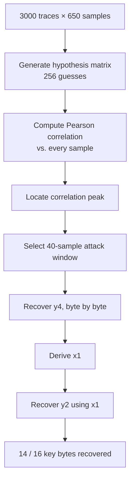
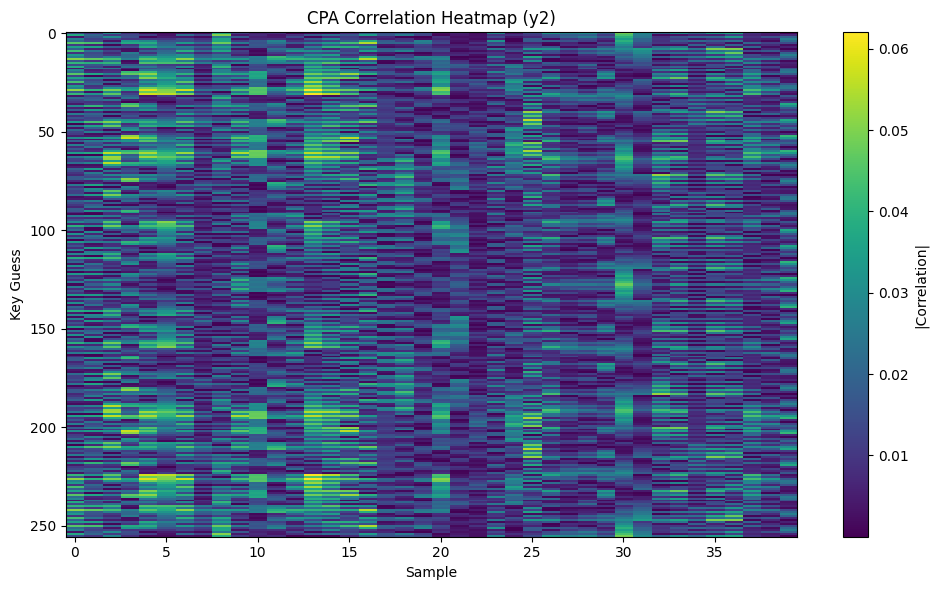
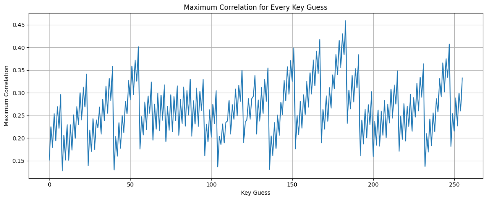
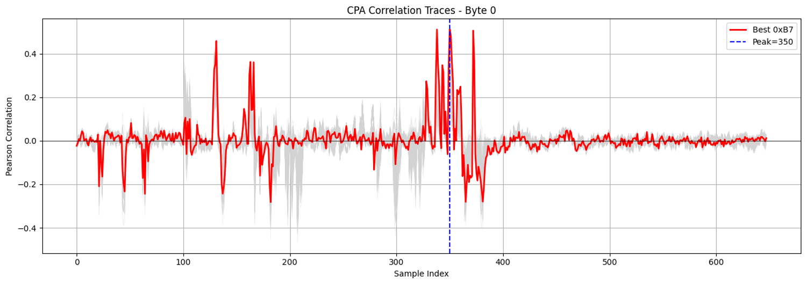
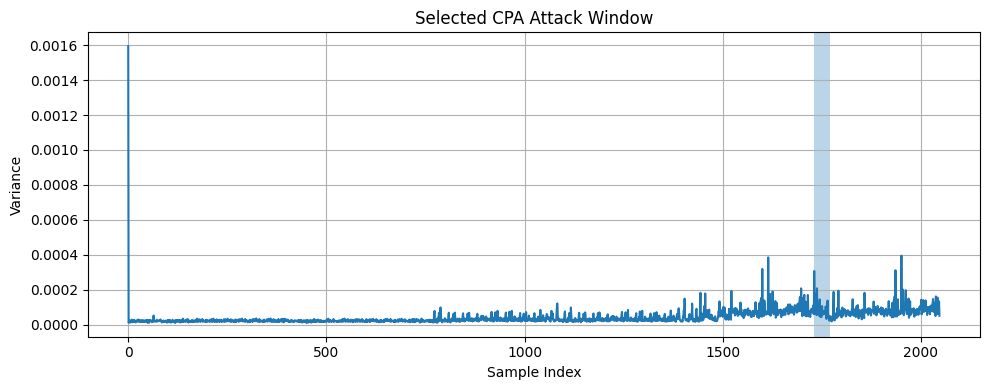

# Chapter 9 — Correlation Power Analysis Attack

*[← 08 — Leakage Model](08_Leakage_Model.md) · [README](../README.md) · Next: [10 — Results →](10_Results.md)*

---

## 9.1 What This Chapter Assembles

Every preceding chapter contributed one piece: [Chapter 5](05_Experimental_Setup.md) produced the raw trace/nonce dataset, [Chapter 7](07_Trace_Capture.md) narrowed it to a 650-sample active region, and [Chapter 8](08_Leakage_Model.md) derived the Boolean leakage equations for `y4` and `y2`. This chapter assembles all three into the complete, executable CPA attack, ending in a recovered secret key.



## 9.2 Starting Dataset

$$T_{\text{window}} \in \mathbb{R}^{3000 \times 650} \qquad\qquad N \in \mathbb{Z}^{3000 \times 16}$$

`T_window` is the region-of-interest-reduced trace matrix from [§7.7](07_Trace_Capture.md#77-selecting-the-active-region-of-interest); `N` is the known nonce matrix. The secret key is treated as entirely unknown by the attack code — it is used only afterward to verify recovered bytes ([Chapter 10](10_Results.md)).

## 9.3 Leakage Localization: Correlation, Not Variance

As emphasized throughout [Chapter 4](04_CPA_Theory.md#410-variance-is-not-correlation) and [Chapter 7](07_Trace_Capture.md#78-variance-identifies-activity--not-leakage), the 650-sample region identified by variance analysis is a search space, not the final answer. The actual leakage-bearing sample is found by computing Pearson correlation for the `y4` leakage model across the **entire** 650-sample window and taking the sample of maximum absolute correlation for the correct-looking key hypothesis:

```python
byte = 0

H = build_hypothesis_matrix(byte, nonce_array)
corr = pearson_correlation(H, trace_window)

best_guess = np.argmax(np.max(np.abs(corr), axis=1))
peak = np.argmax(np.abs(corr[best_guess]))
```

In this project's data, the global variance maximum fell near **sample 1,951** (absolute index, i.e. `551` within the 650-sample window) — but the strongest `y4` correlation peak occurred at a **different** sample, confirming the theoretical point from §4.10 empirically rather than just in principle: **maximum switching activity and maximum key-dependent leakage are not the same location.**

## 9.4 Correlation Heatmaps

Visualizing the full correlation matrix — 256 key guesses × every sample in the window — makes the correct key hypothesis visible as a distinct horizontal band:

```python
byte = 0
H = build_hypothesis_matrix(byte, nonce_array)
corr = pearson_correlation(H, trace_attack)

plt.figure(figsize=(10, 6))
plt.imshow(np.abs(corr), aspect="auto", interpolation="nearest", cmap="viridis")
plt.colorbar(label="|Correlation|")
plt.xlabel("Sample")
plt.ylabel("Key Guess")
plt.title("CPA Correlation Heatmap (y4)")
plt.tight_layout()
plt.show()
```

<p align="center"></p>
<p align="center"><em>Figure 6 — Correlation heatmap for the <code>y4</code> attack, byte 0. The correct key hypothesis appears as a distinct bright band at a specific sample column.</em></p>

The identical procedure, repeated once `x1` has been recovered (§9.9) and the `y2` leakage model (§8.10) substituted in, produces the second-stage heatmap:

<p align="center"></p>
<p align="center"><em>Figure 7 — Correlation heatmap for the <code>y2</code> attack, using the previously recovered <code>x1</code> as a known input.</em></p>

## 9.5 The Correct Key Against Every Wrong Guess

A more direct way to see the distinguishing signal is to overlay the correlation trace of every one of the 256 hypotheses, highlighting only the one matching the known ground-truth key:

```python
byte = 0
corr = pearson_correlation(build_hypothesis_matrix(byte, nonce_array), trace_attack)

plt.figure(figsize=(12, 5))
for kg in range(256):
    if kg == secret_key[byte]:
        plt.plot(corr[kg], linewidth=3, label="Correct Key")
    else:
        plt.plot(corr[kg], alpha=0.08)
plt.xlabel("Sample")
plt.ylabel("Correlation")
plt.title("Correct Key vs Incorrect Key Correlation")
plt.legend()
plt.grid(True)
plt.tight_layout()
plt.show()
```

<p align="center"></p>
<p align="center"><em>Figure 8 — The correct key hypothesis (bold) rises well clear of the dense cluster of 255 incorrect guesses at the leakage sample, giving high confidence in the recovered byte.</em></p>

## 9.6 Ranking All 256 Hypotheses

For a more compact summary than the full heatmap, the maximum correlation achieved by each of the 256 hypotheses (across the whole attack window) can be plotted directly:

```python
byte = 0
plt.figure(figsize=(12, 5))
plt.plot(all_max_corr[byte])
plt.xlabel("Key Guess")
plt.ylabel("Maximum Correlation")
plt.title("Maximum Correlation for Every Key Guess")
plt.grid(True)
plt.tight_layout()
plt.show()
```

<p align="center"></p>
<p align="center"><em>Figure 9 — One point per key hypothesis (0x00–0xFF); the correct key stands out as a clear spike above the noise floor formed by incorrect guesses.</em></p>

## 9.7 Locating the Precise Leakage Sample

Once the best-scoring key guess is identified, the exact sample at which it peaks pinpoints the leakage location within the attack window:

```python
byte = 0
corr = pearson_correlation(build_hypothesis_matrix(byte, nonce_array), trace_window)
best_guess = np.argmax(np.max(np.abs(corr), axis=1))

plt.figure(figsize=(12, 4))
plt.plot(np.abs(corr[best_guess]))
peak = np.argmax(np.abs(corr[best_guess]))
plt.scatter(peak, np.abs(corr[best_guess])[peak], s=80, label=f"Peak = {peak + 1400}")
plt.legend()
plt.xlabel("Sample")
plt.ylabel("Correlation")
plt.title("Leakage Localization using CPA")
plt.grid(True)
plt.tight_layout()
plt.show()
```

<p align="center"></p>
<p align="center"><em>Figure 11 — The marked peak identifies the precise sample (relative to the start of the region of interest) where <code>y4</code>'s Hamming Weight leaks most strongly.</em></p>

For byte 0, this procedure located the peak at approximately **relative sample 350** within the 650-sample window. Since that window begins at absolute sample 1,400, the true leakage location is:

$$1400 + 350 = 1750$$

<p><em>note: the peak value might not me same in all occasion</em></p>

## 9.8 Selecting the Final Attack Window

Rather than continuing to run CPA over the full 650-sample region for every remaining byte, a small window centered on the identified leakage point (sample 1,750) is extracted and reused:

```text
Peak:  1750
Attack window:  1730 → 1770   (40 samples)
```

```python
trace_attack = trace_window[:, 330:370]
```

<p align="center"></p>
<p align="center"><em>Figure 5 — The final attack window (samples 1,730–1,770), shown against the variance trace from Chapter 7 for reference. Note this window is centered on the correlation peak from §9.7, not the variance peak.</em></p>

This reduces the per-byte correlation computation from 650 samples down to **40**, cutting execution time substantially while retaining the dominant leakage signal identified in §9.7.

## 9.9 Recovering `y4`

For each of the 8 key bytes feeding the `y4` equation (§8.4):

1. Generate the 256-hypothesis matrix for that byte.
2. Compute the Hamming-Weight-predicted leakage for every hypothesis.
3. Correlate against the 40-sample attack window.
4. Take the hypothesis with maximum absolute correlation as the recovered byte.

Repeating this independently across all 8 bytes recovers `y4` for the first half of the key, which is then used (§8.9) to derive the intermediate state value `x1`.

## 9.10 Recovering `y2`

With `x1` now known, the second leakage model (§8.10) is constructed and the **identical** attack procedure — steps 1 through 4 above — is repeated, this time correlating against the `y2` equation instead of `y4`. No new methodology is required; only the leakage equation and the set of "known" inputs change.

## 9.11 Computational Cost

For a single key byte, the correlation step requires evaluating:

$$256 \text{ hypotheses} \times 3000 \text{ traces} \times 40 \text{ samples}$$

Implemented with vectorized NumPy operations over the hypothesis and trace matrices (rather than explicit nested Python loops), this computation executes efficiently — the 40-sample attack window from §9.8 is what keeps this cost manageable across all attacked bytes, compared to running the same computation over the full 650-sample region every time.

## 9.12 Experimental Outcome

Applying this complete procedure across all attacked key bytes recovered:

$$\boxed{14 \text{ of } 16 \text{ secret key bytes}}$$

The two unrecovered bytes consistently produced lower correlation magnitudes than the rest at their respective leakage points — a pattern consistent with weaker physical leakage or insufficient trace count rather than an error in the Boolean leakage equations themselves, as discussed further in [Chapter 11](11_Limitations.md).

## 9.13 Key Observations From This Attack

- The global variance maximum (§9.3) and the true `y4` correlation peak occurred at **different** samples — the central empirical confirmation of §4.10's theoretical point.
- Correlation-based localization (§9.7–9.8) automatically identified both the correct key hypothesis *and* the sample at which to attack, without needing to guess a window manually.
- Restricting the attack to a 40-sample window reduced computation substantially with no loss in successfully recovered bytes.
- The progressive `y4 → x1 → y2` chain kept every sub-attack at a manageable 256-hypothesis search, never requiring joint hypotheses over multiple key bytes at once.
- The Hamming Weight model, despite being an approximation of real hardware behavior, was accurate enough to cleanly separate the correct key from all 255 incorrect guesses for the majority of attacked bytes (Figure 8).

## 9.14 Chapter Summary

This chapter executed the complete Correlation Power Analysis attack: correlation-based leakage localization (distinct from, and more precise than, the variance-based region selection from Chapter 7), a compact 40-sample attack window, and the progressive `y4 → x1 → y2` recovery chain derived in Chapter 8. The result — **14 of 16 secret key bytes recovered from 3,000 traces on a ChipWhisperer Nano** — is examined in full detail, including the remaining figures and the recovered-key table, in [Chapter 10](10_Results.md).

---

*Next: [Chapter 10 — Experimental Results](10_Results.md)*
