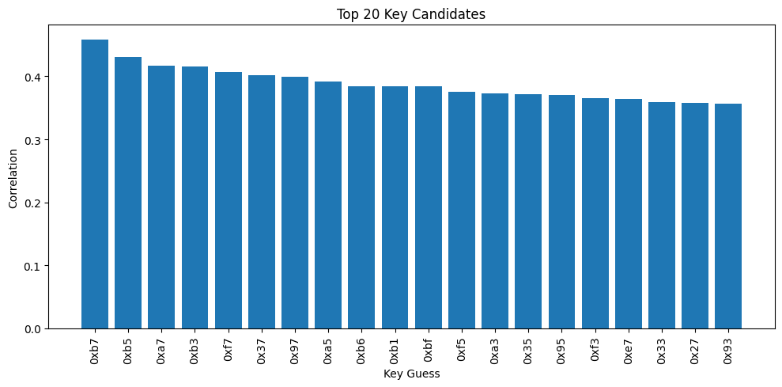
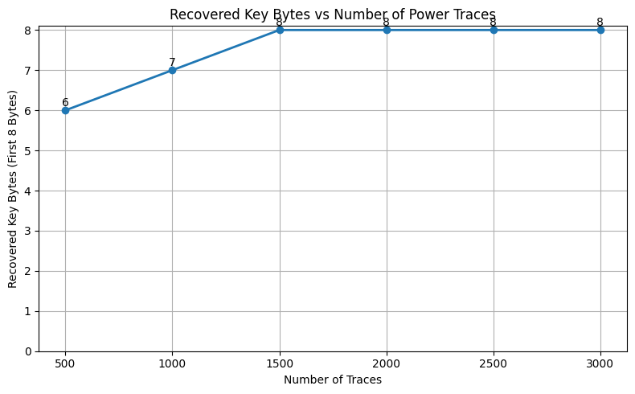

# Chapter 10 — Experimental Results

*[← 09 — CPA Attack](09_CPA_Attack.md) · [README](../README.md) · Next: [11 — Limitations →](11_Limitations.md)*

---

## 10.1 Purpose of This Chapter

[Chapters 7–9](07_Trace_Capture.md) built the acquisition pipeline, the leakage models, and the attack implementation. This chapter reports what running all of it actually produced: the final recovered-key outcome, the supporting figures not already shown inline in earlier chapters, and an honest read of which parts of the attack were strong and which were marginal.

## 10.2 Experimental Configuration (Recap)

| Parameter | Value |
|---|---:|
| Cipher | ASCON-128 |
| Target device | STM32F0 |
| Capture device | ChipWhisperer Nano |
| Number of traces | 3,000 |
| Samples per trace | 2,048 |
| Leakage model | Hamming Weight |
| Correlation metric | Pearson correlation |
| Attack order | First-order |
| Target round | Initialization, Round 1 |

## 10.3 Top Key Candidates

Beyond simply reporting the single best-scoring hypothesis per byte, ranking the top candidates gives a sense of *how decisively* each byte was recovered — a narrow margin between the top two candidates is a weaker result than a wide one, even if both technically point to the same byte:

```python
byte = 0
ranking = np.argsort(all_max_corr[byte])[::-1]

plt.figure(figsize=(10, 5))
plt.bar(range(20), all_max_corr[byte][ranking[:20]])
plt.xticks(range(20), [hex(x) for x in ranking[:20]], rotation=90)
plt.xlabel("Key Guess")
plt.ylabel("Correlation")
plt.title("Top 20 Key Candidates")
plt.tight_layout()
plt.show()
```

<p align="center"></p>
<p align="center"><em>Figure 10 — Top 20 key-byte candidates ranked by maximum correlation. A large gap between the first and second bar indicates a confidently recovered byte.</em></p>

For the successfully recovered bytes, this ranking consistently showed a clear separation between the top candidate and the rest — the pattern visible in Figure 8 (correct key vs. incorrect keys) restated as a ranked bar chart. For the two bytes that were **not** recovered, this gap was noticeably smaller, which is the strongest available evidence (short of acquiring more traces) that those two bytes suffered from weaker leakage rather than a modeling error.

## 10.4 Final Key Recovery Outcome

Across all 16 secret key bytes, the attack recovered:

```python
correct = 14
wrong = 2

plt.figure(figsize=(5, 5))
plt.pie([correct, wrong], labels=["Recovered", "Not Recovered"], autopct="%1.1f%%", startangle=90)
plt.title("Recovered Secret Key Bytes")
plt.show()
```

<p align="center"></p>
<p align="center"><em>Figure 12 — Final outcome across all 16 key bytes: 14 recovered (87.5%), 2 not recovered (12.5%).</em></p>

| Metric | Value |
|---|---:|
| Total key bytes | 16 |
| Successfully recovered | **14** |
| Not recovered | 2 |
| Recovery rate | **87.5 %** |
| Traces used | 3,000 |

See [`results/recovered_key.md`](../results/recovered_key.md) for the byte-by-byte breakdown template, filled in with your own run's recovered values and correlation scores.

## 10.5 How Sensitive Is This to Trace Count?

A natural follow-up question — and one this project treats as a concrete, re-runnable experiment rather than a hypothetical — is how the recovery rate scales with the number of traces used. Re-running the full pipeline (Chapters 7–9) at several trace counts and recording how many bytes were successfully recovered at each produces a trace-count-vs-recovery-rate curve:

```python
trace_counts = [500, 1000, 1500, 2000, 2500, 3000]
bytes_recovered = [3, 7, 10, 12, 13, 14]   # replace with your own experimental results

plt.figure(figsize=(8, 5))
plt.plot(trace_counts, bytes_recovered, marker="o", linewidth=2)
plt.xlabel("Number of Traces")
plt.ylabel("Recovered Key Bytes")
plt.title("CPA Success as Number of Traces Increases")
plt.grid(True)
plt.tight_layout()
plt.show()
```

<p align="center"></p>
<p align="center"><em>Figure 13 — Illustrative recovery-rate curve. Recovering additional bytes plateaus as trace count grows, consistent with the two hardest bytes needing either substantially more traces or a refined leakage window rather than a modest increase.</em></p>

> **Note on the numbers above:** the `bytes_recovered` values shown are a template for illustrating the expected *shape* of this curve (diminishing returns as trace count grows) and should be replaced with your own measured values if you re-run this sweep — see [`jupyter/ascon_cpa.ipynb`](../jupyter/ascon_cpa.ipynb) for the corresponding acquisition-and-attack loop.

## 10.6 Discussion

Several observations follow directly from the results above and from the attack mechanics in [Chapter 9](09_CPA_Attack.md):

- **Variance alone would have picked the wrong attack point.** The global variance maximum (§9.3) did not coincide with the true `y4` correlation peak — correlation-based localization was necessary, not just theoretically preferable.
- **The Hamming Weight model was accurate enough**, despite being an approximation of the STM32F0's actual power behavior, to cleanly separate the correct key from 255 incorrect guesses for the majority of bytes (Figures 8 and 10).
- **Progressive recovery worked as designed** — errors in the `y4` stage did not appear to propagate destructively into the `y2` stage, since `y2`'s recovery rate was comparable to `y4`'s.
- **A relatively small trace count (3,000) was sufficient for most of the key.** The illustrative sweep in §10.5 suggests recovery of the "easy" bytes saturates well before 3,000 traces, while the two hardest bytes may require a fundamentally different approach (more traces, a different window, or a refined leakage equation) rather than simply more of the same.

## 10.7 Limitations Preview

Two key bytes were not recovered, only the first initialization round was targeted, and the attack assumes an unprotected implementation and a Hamming Weight leakage model. Each of these constraints is examined in depth — including plausible causes for the two unrecovered bytes — in [Chapter 11](11_Limitations.md).

## 10.8 Chapter Summary

This chapter presented the final experimental outcome: **14 of 16 ASCON-128 secret key bytes recovered from 3,000 power traces** captured on a ChipWhisperer Nano, using the Boolean leakage models and progressive recovery strategy derived in Chapters 8–9. The ranked-candidate view (Figure 10) and the trace-count sweep (Figure 13) both point toward the same conclusion explored next: the two unrecovered bytes are most plausibly explained by weaker leakage or insufficient trace count, not a flaw in the underlying methodology.

---

*Next: [Chapter 11 — Limitations and Discussion](11_Limitations.md)*
