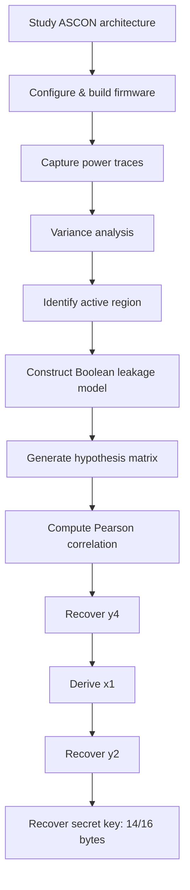

# Chapter 12 — Conclusion and Future Work

*[← 11 — Limitations](11_Limitations.md) · [README](../README.md) · [References →](References.md)*

---

## 12.1 Conclusion

This repository documented a complete, from-scratch implementation of a **first-order Correlation Power Analysis attack** against an unprotected implementation of **ASCON-128** executing on an STM32F0 microcontroller, measured with a **ChipWhisperer Nano**. Unlike the majority of publicly available CPA material, which targets AES's convenient byte-oriented S-box, this project attacked ASCON's **bit-sliced Boolean permutation** — a structure that offered no existing leakage model to reuse and required deriving one from the cipher's internal round equations directly ([Chapter 8](08_Leakage_Model.md)).

Rather than targeting the ciphertext or attempting to model the full 320-bit state at once, the attack targeted carefully chosen intermediate variables produced during the **first initialization round**, and recovered them progressively — `y4`, then the derived `x1`, then `y2` — turning what would otherwise be an intractable joint hypothesis problem into a sequence of independent, 256-hypothesis CPA sub-attacks.

## 12.2 The Complete Attack, End to End

Every stage in this diagram corresponds to one or more chapters in this repository, documented in enough detail — including the dead ends, like the masked firmware that would not build ([Chapter 6](06_Firmware_Modifications.md)) — to be independently reproduced.

## 12.3 Experimental Results Recap

| Parameter | Value |
|---|---:|
| Capture platform | ChipWhisperer Nano |
| Target device | STM32F0 |
| Algorithm | ASCON-128 |
| Traces | 3,000 |
| Samples per trace | 2,048 |
| Leakage model | Hamming Weight |
| Attack order | First-order |
| **Key bytes recovered** | **14 / 16** |

## 12.4 Main Contributions

- A complete first-order CPA attack against ASCON-128's Boolean permutation, with no existing S-box-oriented tutorial to adapt.
- Hand-derived Boolean leakage models for the intermediate variables `y4` and `y2`, expressed entirely in known nonce/IV bytes plus one unknown key byte per hypothesis.
- A working, documented adaptation of the official ASCON SimpleSerial firmware for the ChipWhisperer Nano, including the specific build failures encountered with the masked implementation.
- A progressive recovery strategy (`y4 → x1 → y2`) generalizable to other permutation-based, Boolean-only ciphers lacking a convenient S-box target.
- Empirical, not just theoretical, demonstration that variance-based region selection and correlation-based leakage localization identify **different** samples — and that trusting the former for the final attack window would have been a methodological mistake.
- A complete, versioned figure set and 3,000-trace analysis pipeline, reproducible end-to-end from firmware build through recovered key.

## 12.5 Key Observations

- An unprotected ASCON implementation leaks enough information for practical first-order CPA — mathematical security and implementation security are genuinely separate properties.
- Maximum variance does **not** imply maximum key-dependent leakage; this project's own data contradicts that common simplification directly (§9.3).
- Pearson correlation is significantly more reliable than variance for locating the true leakage-bearing sample.
- Progressive recovery is what makes attacking a permutation-based, non-S-box cipher tractable one intermediate at a time.
- Precise trigger placement and trace alignment are prerequisites for any of the above statistics to be meaningful — not implementation detail to skip past.
- Even entry-level, sub-$50 acquisition hardware can produce a meaningful, near-complete key recovery against an undefended implementation.

## 12.6 Lessons Learned

This project required combining several distinct skill sets: embedded firmware development and cross-compilation, power trace acquisition and hardware triggering, statistical signal processing (variance, Pearson correlation), Boolean algebra applied directly to a cipher's round function, and honest experimental evaluation (including reporting what *didn't* fully work — the 2 unrecovered bytes, the masked-firmware build failure). The clearest lesson, restated from [Chapter 11](11_Limitations.md#1114-lessons-learned): **theoretical cryptographic strength and practical implementation security have to be evaluated separately, with real hardware, not assumed from one another.**

## 12.7 Reproducibility

Every stage of this attack is documented with enough detail to reproduce independently:

- Hardware and software configuration ([Chapter 5](05_Experimental_Setup.md))
- Firmware selection, build failures, and final configuration ([Chapter 6](06_Firmware_Modifications.md))
- Acquisition methodology and preprocessing ([Chapter 7](07_Trace_Capture.md))
- Leakage-model derivation ([Chapter 8](08_Leakage_Model.md))
- Full CPA implementation ([Chapter 9](09_CPA_Attack.md))
- Experimental evaluation and figures ([Chapter 10](10_Results.md))

The intent is for a student or researcher to reproduce every figure in this repository — not just read about the result — using [`jupyter/ascon_cpa.ipynb`](../jupyter/ascon_cpa.ipynb) and the firmware in [`firmware/simpleserial-ascon`](../firmware/simpleserial-ascon).

## 12.8 Future Work

### 12.8.1 Complete Recovery of the Remaining 2 Bytes

The most direct next step: acquire substantially more traces (§11.5), and/or re-tune the attack window for those two bytes specifically, before concluding a deeper modeling change is required.

### 12.8.2 Attack the Masked Implementation

Now that the unprotected reference implementation has a working, documented CWNANO build ([Chapter 6](06_Firmware_Modifications.md)), revisiting the masked `protected_bi32_armv6` build failure — potentially with a newer toolchain or a patched shared-API shim — would open the door to testing whether this project's first-order methodology is (as expected) defeated by masking, and what a corresponding second-order attack would require.

### 12.8.3 Higher-Order Power Analysis

This work is exclusively **first-order** (§4.11). Extending it to second-order (or general higher-order) CPA — correlating combinations of leaked shares rather than a single intermediate — is the natural next step for attacking masked implementations specifically.

### 12.8.4 Attack Later Rounds and Phases

Only initialization Round 1 was targeted (§11.9). Extending the Boolean-derivation methodology of [Chapter 8](08_Leakage_Model.md) to later initialization rounds, associated-data absorption, plaintext processing, or finalization would require accounting for accumulated diffusion — a substantially harder but well-motivated extension.

### 12.8.5 Alternative Leakage Models

Hamming Distance, bit-level, transition-count, or multivariate leakage models (§2.4) could be compared directly against the Hamming Weight model used here, particularly for the two bytes this project did not recover — a mismatch between the true hardware behavior and the HW approximation is one plausible (if currently unconfirmed) explanation worth testing.

### 12.8.6 Other Hardware Targets

Repeating this exact methodology on STM32F3/F4, AVR, ARM Cortex-M4, or RISC-V targets would clarify how much of this project's specific findings (leakage sample locations, which bytes are hardest) are STM32F0/CWNANO-specific artifacts versus more general properties of unprotected ASCON software implementations.

### 12.8.7 Evaluating Countermeasures

Testing implementation-level countermeasures — Boolean masking (once buildable, per §12.8.2), random delay insertion, execution shuffling, or power-hiding techniques — against this same attack pipeline would provide a concrete before/after comparison of their practical effectiveness, rather than a purely theoretical one.

### 12.8.8 Automated Leakage-Point Detection

Rather than manually inspecting variance plots and correlation heatmaps to select attack windows (Chapters 7 and 9), automated leakage detection — via signal-processing techniques, dimensionality reduction, or learned detectors — could generalize this project's manual localization workflow to new targets with less manual tuning.

## 12.9 Final Remarks

ASCON was selected by NIST specifically because of its strong mathematical security properties and its efficiency on lightweight devices. **Nothing in this repository challenges that.** What this project demonstrates instead is a narrower, and arguably more practically important, principle:

> A cryptographic algorithm can be mathematically secure while its physical implementation remains vulnerable to side-channel analysis.

By exploiting information leaked through power consumption alone — no plaintext, no ciphertext, no mathematical weakness in ASCON itself — this project recovered the majority of a real secret key from a real device, using acquisition hardware costing under $50. The results underline why implementation-level countermeasures (masking, hiding, shuffling) remain necessary for any deployment of ASCON, or any cipher, on hardware an attacker can physically access.

This repository is offered both as an educational on-ramp for newcomers to side-channel analysis and as a practical, reproducible reference for researchers studying the physical security of lightweight cryptographic algorithms.

---

**Project Summary**

| | |
|---|---|
| Algorithm | ASCON-128 |
| Target | STM32F0 |
| Measurement device | ChipWhisperer Nano |
| Power traces | 3,000 |
| Leakage model | Hamming Weight |
| Statistical method | Pearson correlation |
| **Recovered key** | **14 / 16 bytes** |

---

*[← Back to README](../README.md) · [References](References.md)*

**End of chapter documentation.**
